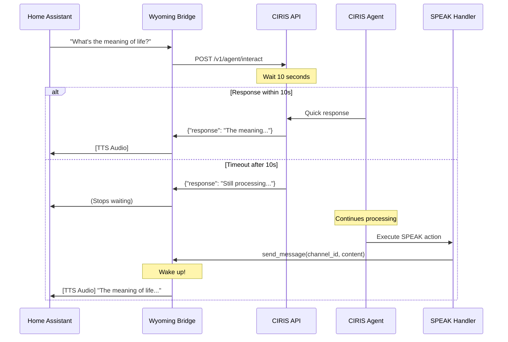

# Wyoming Protocol + CIRIS Agent Integration

## How It Works

### Current Flow (Needs Updating)

1. **Voice Input** → Wyoming bridge receives audio
2. **STT** → Transcribes to text
3. **CIRIS Request** → Sends to `/v1/messages` (wrong endpoint)
4. **Wait** → Blocks for response
5. **TTS** → Converts response to speech

### Correct CIRIS Integration

The CIRIS agent architecture provides a perfect mechanism for async voice responses through the **SPEAK handler**:

1. **Voice Input** → Wyoming bridge → `/v1/agent/interact` 
2. **API waits 10 seconds** for response
3. **If timeout**, API returns acknowledgment
4. **Agent continues processing** → Eventually executes SPEAK action
5. **SPEAK handler** → Calls `communication_bus.send_message_sync()`
6. **Communication service** → Can wake up Wyoming bridge!

## The Key: Wyoming as a CIRIS Adapter

Instead of just being an API client, Wyoming should be a **full CIRIS adapter** that:

### 1. Registers as Communication Provider

```python
class WyomingAdapter(BaseAdapter):
    """Wyoming voice adapter for CIRIS."""
    
    def __init__(self, wyoming_config):
        super().__init__(adapter_id="wyoming_voice")
        self.wyoming_server = None
        self.active_sessions = {}  # channel_id -> wyoming_connection
        
    def get_service_registrations(self):
        return [
            AdapterServiceRegistration(
                service_type=ServiceType.COMMUNICATION,
                enabled=True,
                capabilities=["voice_interaction", "async_speech"]
            )
        ]
    
    async def send_message(self, channel_id: str, content: str, **kwargs) -> bool:
        """Called by SPEAK handler to send voice response."""
        # This is the magic - wake up Wyoming and speak!
        session = self.active_sessions.get(channel_id)
        if session:
            # Trigger TTS and send audio to Home Assistant
            await session.speak(content)
            return True
        return False
```

### 2. Channel Management

Each voice session gets a unique channel:

```python
# When voice interaction starts
channel_id = f"wyoming_{device_id}_{session_id}"

# Register the session
self.active_sessions[channel_id] = WyomingSession(
    device_id=device_id,
    wyoming_connection=connection,
    can_interrupt=True
)
```

### 3. The Full Flow



## Implementation Details

### 1. Wyoming Adapter Registration

```python
# In main.py or adapter initialization
async def register_wyoming_adapter(runtime):
    wyoming_adapter = WyomingAdapter(config)
    
    # Start Wyoming server
    await wyoming_adapter.start_server()
    
    # Register with CIRIS
    runtime.adapter_manager.register_adapter(wyoming_adapter)
```

### 2. Modified Wyoming Handler

```python
class CIRISWyomingHandler(AsyncEventHandler):
    def __init__(self, config: Config, adapter: WyomingAdapter):
        self.adapter = adapter
        self.pending_response = None
        
    async def handle_transcript(self, text: str, session_id: str):
        """Handle transcribed voice input."""
        
        # Create unique channel for this session
        channel_id = f"wyoming_{session_id}"
        
        # Register session with adapter
        self.adapter.register_session(channel_id, self)
        
        # Send to CIRIS with 10s timeout
        try:
            response = await asyncio.wait_for(
                self.ciris_client.interact(
                    message=text,
                    channel_id=channel_id
                ),
                timeout=10.0
            )
            
            # Got quick response
            return response.response
            
        except asyncio.TimeoutError:
            # Will get response later via SPEAK
            self.pending_response = True
            return None  # Don't speak yet
    
    async def speak(self, content: str):
        """Called by adapter when SPEAK executes."""
        # This wakes up the voice assistant!
        await self.send_tts_audio(content)
        self.pending_response = False
```

### 3. Home Assistant Integration

The Wyoming protocol already supports async wake-up:

```yaml
# Home Assistant configuration
voice_assistant:
  - platform: wyoming
    host: localhost
    port: 10300
    # Wyoming can wake up HA when ready
    wake_word: "hey jarvis"
```

## Benefits of This Approach

1. **Natural Async Behavior**: Voice assistant can respond whenever CIRIS is ready
2. **No Polling**: SPEAK handler pushes response when ready
3. **Channel Isolation**: Each voice session has its own channel
4. **Unified Architecture**: Wyoming becomes a first-class CIRIS adapter
5. **Wake Word Support**: Can wake up HA even after timeout

## Configuration Example

```yaml
# ciris_voice_config.yaml
wyoming:
  adapter:
    enabled: true
    adapter_id: "wyoming_voice"
    
  server:
    host: "0.0.0.0"
    port: 10300
    
  interaction:
    initial_timeout_seconds: 10
    max_processing_seconds: 60
    
  responses:
    thinking:
      - "Let me think about that..."
      - "Give me a moment..."
      - "I'm processing your request..."
    timeout:
      - "I need more time to think about this properly."
      - "This requires deeper consideration."
      
  channels:
    prefix: "wyoming"
    include_device_id: true
    session_timeout_minutes: 5
```

## User Experience

### Scenario 1: Quick Response (< 10s)
```
User: "What time is it?"
Assistant: [2 second pause] "It's 3:45 PM"
```

### Scenario 2: Complex Query (> 10s)
```
User: "What's the meaning of life?"
Assistant: [10 second wait, then stops listening]
... 20 seconds later ...
Assistant: [Wakes up] "The meaning of life, I believe, is the pursuit 
           of mutual sentient flourishing..."
```

### Scenario 3: Follow-up Query
```
User: "Tell me about quantum physics"
Assistant: [10 seconds] "I need more time to formulate a proper explanation."
User: [Does something else]
... 30 seconds later ...
Assistant: [Wakes up] "Quantum physics is the study of matter and energy
           at the smallest scales..."
```

## Technical Requirements

1. **Wyoming Adapter** must implement:
   - `BaseAdapter` interface
   - `CommunicationService` protocol
   - Session management
   - Wake-up capability

2. **API Integration** needs:
   - Proper channel routing
   - Message correlation
   - Timeout handling

3. **Home Assistant** requires:
   - Wyoming protocol 1.0+
   - Wake word support
   - Async audio handling

## Migration Steps

1. **Update ciris_client.py** to use `/v1/agent/interact`
2. **Create WyomingAdapter** class extending BaseAdapter
3. **Modify bridge.py** to register as adapter
4. **Add session management** for channel tracking
5. **Implement wake-up** in speak() method
6. **Test async responses** with various timeouts

## Edge Cases

1. **Multiple Devices**: Use device-specific channels
2. **Interrupted Sessions**: Clean up abandoned channels
3. **Network Issues**: Graceful fallback to sync mode
4. **Long Responses**: Stream in chunks if > 30s
5. **Context Preservation**: Maintain conversation context

This architecture leverages CIRIS's native communication system to provide natural, async voice interactions without polling or complex state management.