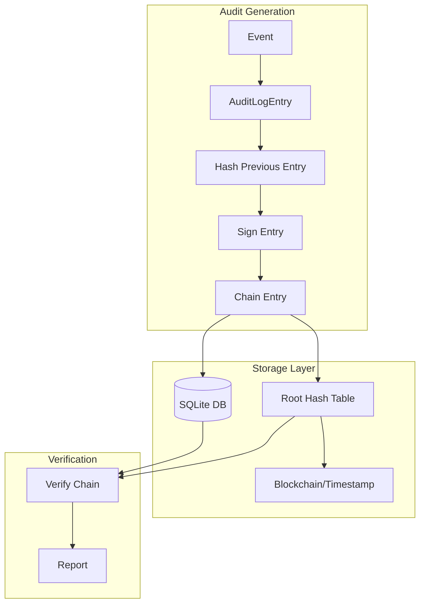
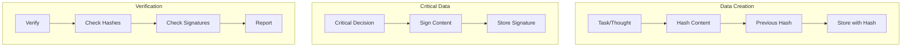
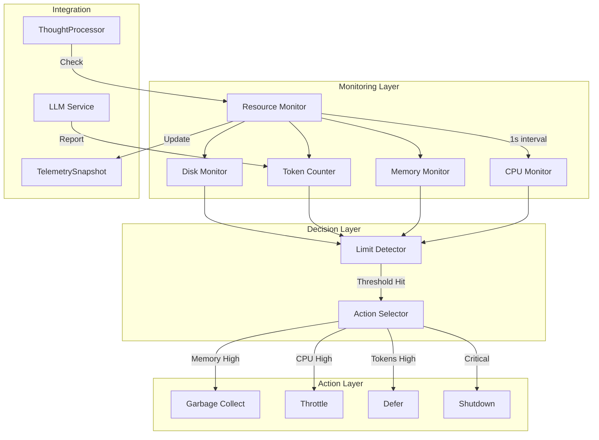

# CIRIS Agent Pre-Beta Feature Implementation Status

## Document Status
**Version**: 0.2.0-pre-beta  
**Status**: PARTIAL IMPLEMENTATION - WORK IN PROGRESS  
**Last Updated**: 2025-01-06

## Executive Summary

This document tracks the implementation status of critical features for CIRIS Agent pre-beta release. While significant foundational work has been completed on signed audit trails, telemetry systems, network schemas, and secrets management, **substantial integration and testing work remains before the system is mission-critical ready**.

## ⚠️ CRITICAL DISCLAIMER

**The current implementation is NOT production-ready.** Key limitations include:

- Audit system components exist but are not integrated with the main agent
- Telemetry system has only stub implementations  
- No comprehensive test coverage for security-critical components
- Database migrations may not be properly applied
- Integration between systems is incomplete
- Performance impact has not been validated

## Implementation Status Overview

### ✅ COMPLETED Components

#### 1. Signed Audit Trail Core Infrastructure
**Status**: Foundation implemented, needs integration
- ✅ `AuditHashChain` class with SHA-256 hash chaining
- ✅ `AuditSignatureManager` with RSA-PSS signing  
- ✅ `AuditVerifier` with tamper detection
- ✅ Database migration 003 with audit_log_v2 schema
- ❌ **NOT INTEGRATED** with existing audit service
- ❌ **NO TESTS** for security-critical functions

#### 2. Network Schemas (Documentation Only)
**Status**: Specifications complete, no implementation  
- ✅ `NETWORK_SCHEMAS.md` with comprehensive schema designs
- ✅ Minimal memory footprint designs for constrained devices
- ✅ Universal Guidance Protocol specification
- ❌ **NO ACTUAL SCHEMA FILES CREATED**
- ❌ **NO IMPLEMENTATION CODE**

#### 3. Telemetry System (Stub Only)
**Status**: Architecture defined, minimal implementation
- ✅ `TelemetryService` interface defined
- ✅ Security filtering architecture specified  
- ✅ `TELEMETRY.md` with comprehensive specifications
- ❌ **ONLY __init__.py EXISTS** - no actual implementation
- ❌ **NO INTEGRATION** with SystemSnapshot

#### 4. Secrets Management (From Previous Work)
**Status**: Implemented and documented
- ✅ Encryption service with Fernet
- ✅ Graph memory integration
- ✅ FORGET behavior implementation
- ✅ Comprehensive documentation

### ❌ MISSING CRITICAL COMPONENTS

#### 1. Integration Layer
- **AuditService Integration**: Existing audit service needs to use new signed trail
- **Persistence Integration**: Hash chains need to be added to tasks/thoughts  
- **Context Integration**: SystemSnapshot needs telemetry data
- **Service Registry**: New services need proper registration

#### 2. Testing & Validation
- **Security Tests**: No tests for crypto components
- **Performance Tests**: No validation of overhead impact
- **Integration Tests**: No end-to-end testing
- **Failure Mode Tests**: No testing of degraded scenarios

#### 3. Configuration Management
- **Dynamic Config**: New features need config integration
- **Migration Scripts**: Database migrations need testing
- **Deployment Scripts**: No deployment automation for new features

#### 4. Production Readiness
- **Error Handling**: Incomplete error handling in many components
- **Logging**: Inconsistent logging across new components  
- **Monitoring**: No health checks for new services
- **Documentation**: Implementation docs are missing

## 🚨 REMAINING WORK FOR MISSION-CRITICAL READINESS

### High Priority (Blockers for Beta)

1. **Audit System Integration** (Est: 3-5 days)
   - Integrate signed audit trail with existing `LocalAuditLog` service
   - Apply database migration 003 safely
   - Add comprehensive error handling
   - Create tests for all crypto components

2. **Telemetry Implementation** (Est: 2-3 days)  
   - Implement actual `TelemetryService` class
   - Create security filter implementation
   - Integrate with `SystemSnapshot`
   - Add performance monitoring

3. **Network Schema Implementation** (Est: 2-3 days)
   - Create actual Pydantic schema files from specifications
   - Update schema registry and exports
   - Integrate with existing context and graph systems
   - Test memory usage on constrained devices

### Medium Priority (Quality & Robustness)

4. **Testing Infrastructure** (Est: 4-5 days)
   - Security test suite for audit components
   - Performance benchmarks for all new features
   - Integration tests for end-to-end flows
   - Failure mode and recovery testing

5. **Configuration & Deployment** (Est: 2-3 days)
   - Update configuration schemas and loaders
   - Create deployment scripts for new features
   - Database migration runner and rollback
   - Health checks and monitoring endpoints

### Low Priority (Polish & Documentation)

6. **Documentation & Examples** (Est: 1-2 days)
   - API documentation for new components
   - Usage examples and tutorials
   - Deployment guides
   - Troubleshooting documentation

## Risk Assessment

### Security Risks
- ⚠️ **Crypto implementation untested** - potential for signature bypass
- ⚠️ **Database migration safety** - could corrupt existing audit logs  
- ⚠️ **Key management gaps** - no key rotation or backup procedures

### Operational Risks  
- ⚠️ **Performance impact unknown** - new features could slow agent significantly
- ⚠️ **Resource consumption** - memory usage on constrained devices untested
- ⚠️ **Integration failures** - new services could break existing functionality

### Deployment Risks
- ⚠️ **Configuration complexity** - new settings could cause misconfigurations
- ⚠️ **Migration failures** - database upgrades could fail in production
- ⚠️ **Rollback procedures** - no tested rollback for failed deployments

## Recommendations

1. **DO NOT deploy to production** until integration and testing are complete
2. **Prioritize audit system integration** as it's furthest along
3. **Create comprehensive test suite** before any production deployment  
4. **Test on actual constrained hardware** (Raspberry Pi) before claiming compatibility
5. **Implement proper error handling** and graceful degradation for all new features

## Architecture Overview (From Original Specifications)



## Data Schema

### SQL Table: audit_log_v2
```sql
CREATE TABLE IF NOT EXISTS audit_log_v2 (
    entry_id INTEGER PRIMARY KEY AUTOINCREMENT,
    event_id TEXT NOT NULL UNIQUE,              -- UUID for the event
    event_timestamp TEXT NOT NULL,              -- ISO8601
    event_type TEXT NOT NULL,
    originator_id TEXT NOT NULL,
    event_payload TEXT,                         -- JSON payload
    
    -- Hash chain fields
    sequence_number INTEGER NOT NULL,           -- Monotonic counter
    previous_hash TEXT NOT NULL,                -- SHA-256 of previous entry
    entry_hash TEXT NOT NULL,                   -- SHA-256 of this entry's content
    
    -- Signature fields
    signature TEXT NOT NULL,                    -- Base64 encoded signature
    signing_key_id TEXT NOT NULL,               -- Key used to sign
    
    -- Indexing
    created_at TEXT NOT NULL DEFAULT CURRENT_TIMESTAMP,
    
    -- Constraints
    UNIQUE(sequence_number),
    CHECK(sequence_number > 0)
);

CREATE INDEX IF NOT EXISTS idx_audit_event_type ON audit_log_v2(event_type);
CREATE INDEX IF NOT EXISTS idx_audit_timestamp ON audit_log_v2(event_timestamp);
CREATE INDEX IF NOT EXISTS idx_audit_originator ON audit_log_v2(originator_id);
```

### Root Hash Anchoring Table
```sql
CREATE TABLE IF NOT EXISTS audit_roots (
    root_id INTEGER PRIMARY KEY AUTOINCREMENT,
    sequence_start INTEGER NOT NULL,
    sequence_end INTEGER NOT NULL,
    root_hash TEXT NOT NULL,                    -- Merkle root of entries
    timestamp TEXT NOT NULL,
    external_anchor TEXT,                       -- External timestamp proof
    
    UNIQUE(sequence_start, sequence_end)
);
```

## Implementation Components

### 1. Hash Chain Manager
```python
import hashlib
import json
from typing import Optional, Dict, Any

class AuditHashChain:
    """Manages the cryptographic hash chain for audit entries"""
    
    def __init__(self, db_path: str):
        self.db_path = db_path
        self._last_hash: Optional[str] = None
        self._sequence_number: int = 0
        
    def compute_entry_hash(self, entry: Dict[str, Any]) -> str:
        """Compute deterministic hash of entry content"""
        # Create canonical representation
        canonical = json.dumps({
            "event_id": entry["event_id"],
            "event_timestamp": entry["event_timestamp"],
            "event_type": entry["event_type"],
            "originator_id": entry["originator_id"],
            "event_payload": entry.get("event_payload", ""),
            "sequence_number": entry["sequence_number"],
            "previous_hash": entry["previous_hash"]
        }, sort_keys=True)
        
        return hashlib.sha256(canonical.encode()).hexdigest()
    
    def get_last_entry(self) -> Optional[Dict[str, Any]]:
        """Retrieve the last entry from the chain"""
        # Query SQLite for highest sequence_number
        # Return entry or None if chain is empty
        pass
```

### 2. Signature Manager
```python
import base64
from cryptography.hazmat.primitives import hashes, serialization
from cryptography.hazmat.primitives.asymmetric import rsa, padding

class AuditSignatureManager:
    """Manages signing keys and signatures for audit entries"""
    
    def __init__(self, key_path: str):
        self.key_path = key_path
        self._private_key = None
        self._public_key = None
        self._key_id = None
        
    def load_or_generate_keys(self):
        """Load existing keys or generate new ones"""
        try:
            # Try to load existing key
            with open(f"{self.key_path}/audit_private.pem", "rb") as f:
                self._private_key = serialization.load_pem_private_key(
                    f.read(), password=None
                )
        except FileNotFoundError:
            # Generate new key pair
            self._private_key = rsa.generate_private_key(
                public_exponent=65537,
                key_size=2048  # Small for embedded devices
            )
            # Save keys
            self._save_keys()
        
        self._public_key = self._private_key.public_key()
        self._key_id = self._compute_key_id()
    
    def sign_entry(self, entry_hash: str) -> str:
        """Sign an entry hash and return base64 encoded signature"""
        signature = self._private_key.sign(
            entry_hash.encode(),
            padding.PSS(
                mgf=padding.MGF1(hashes.SHA256()),
                salt_length=padding.PSS.MAX_LENGTH
            ),
            hashes.SHA256()
        )
        return base64.b64encode(signature).decode()
```

### 3. Tamper Detection
```python
class AuditVerifier:
    """Verifies audit log integrity"""
    
    def verify_chain(self, start_seq: int = 1, end_seq: Optional[int] = None) -> bool:
        """Verify hash chain integrity"""
        # Load entries from start_seq to end_seq
        # For each entry:
        #   1. Recompute entry hash
        #   2. Verify it matches stored hash
        #   3. Verify previous_hash matches previous entry
        #   4. Verify signature
        pass
    
    def find_tampering(self) -> Optional[int]:
        """Find first tampered entry in chain"""
        # Binary search to find break in chain
        pass
```

## Integration Points

### 1. AuditService Enhancement
```python
# In ciris_engine/adapters/local_audit_log.py
class AuditService(Service):
    def __init__(self, ...):
        # ... existing init ...
        self.hash_chain = AuditHashChain(self.db_path)
        self.signature_mgr = AuditSignatureManager(self.key_path)
        self.signature_mgr.load_or_generate_keys()
    
    async def log_action(self, handler_action, context, outcome=None):
        """Enhanced to include hash chain and signature"""
        entry = self._create_entry(handler_action, context, outcome)
        
        # Get chain state
        last_entry = self.hash_chain.get_last_entry()
        entry["sequence_number"] = (last_entry["sequence_number"] + 1) if last_entry else 1
        entry["previous_hash"] = last_entry["entry_hash"] if last_entry else "genesis"
        
        # Compute hash
        entry["entry_hash"] = self.hash_chain.compute_entry_hash(entry)
        
        # Sign the hash
        entry["signature"] = self.signature_mgr.sign_entry(entry["entry_hash"])
        entry["signing_key_id"] = self.signature_mgr._key_id
        
        # Store with transaction
        self._store_entry(entry)
```

### 2. Periodic Root Anchoring
```python
class RootAnchorService:
    """Periodically anchors audit log roots"""
    
    async def anchor_periodically(self, interval_seconds: int = 3600):
        """Create Merkle root every hour"""
        while True:
            await asyncio.sleep(interval_seconds)
            root_hash = self._compute_merkle_root()
            
            # Option 1: Timestamp on public blockchain
            # Option 2: RFC 3161 timestamp
            # Option 3: Just log locally for now
            
            self._store_root(root_hash)
```

## Security Properties

1. **Immutability**: Any modification breaks the hash chain
2. **Non-repudiation**: Signatures prove who created entries  
3. **Ordering**: Sequence numbers prevent reordering
4. **Completeness**: Missing entries are detectable
5. **Time-stamping**: External anchors prove existence time

## Performance Considerations

- **Hashing**: ~0.1ms per entry (SHA-256)
- **Signing**: ~2ms per entry (RSA-2048)
- **Verification**: ~3ms per entry
- **Storage overhead**: ~500 bytes per entry
- **Batch verification**: Process 1000 entries/second

## Configuration
```yaml
audit:
  hash_chain:
    enabled: true
    algorithm: "sha256"
  
  signatures:
    enabled: true
    algorithm: "rsa-pss"
    key_size: 2048
    key_rotation_days: 90
    
  anchoring:
    enabled: true
    interval_hours: 1
    method: "local"  # "blockchain", "rfc3161", "local"
```

---

# CIRIS Agent Persistence Layer Tamper Evidence - Functional Specification Document

## Document Status
**Version**: 0.1.0-pre-alpha  
**Status**: DRAFT  
**Last Updated**: 2024-01-09

## Executive Summary

This document specifies tamper evidence mechanisms for the core persistence layer (tasks, thoughts, graph memory) to ensure data integrity throughout the agent's operation. The system provides lightweight integrity checking suitable for resource-constrained deployments.

## Design Principles

1. **Unified Approach**: Same hash chain pattern as audit logs
2. **Minimal Overhead**: Don't slow down thought processing
3. **Selective Protection**: Only critical data needs signing
4. **Backward Compatible**: Existing data remains accessible

## Architecture Overview



## Enhanced Database Schema

### Tasks Table Enhancement
```sql
-- Add integrity columns to tasks table
ALTER TABLE tasks ADD COLUMN content_hash TEXT;
ALTER TABLE tasks ADD COLUMN previous_task_hash TEXT;
ALTER TABLE tasks ADD COLUMN signature TEXT;  -- Only for critical tasks

-- Index for chain traversal
CREATE INDEX IF NOT EXISTS idx_tasks_previous_hash ON tasks(previous_task_hash);
```

### Thoughts Table Enhancement  
```sql
-- Add integrity columns to thoughts table
ALTER TABLE thoughts ADD COLUMN content_hash TEXT;
ALTER TABLE thoughts ADD COLUMN previous_thought_hash TEXT;
ALTER TABLE thoughts ADD COLUMN signature TEXT;  -- Only for DEFERRED thoughts
ALTER TABLE thoughts ADD COLUMN integrity_verified BOOLEAN DEFAULT 0;

-- Index for chain traversal
CREATE INDEX IF NOT EXISTS idx_thoughts_previous_hash ON thoughts(previous_thought_hash);
```

### Graph Memory Enhancement
```sql
-- Add integrity to graph nodes
ALTER TABLE graph_nodes ADD COLUMN content_hash TEXT;
ALTER TABLE graph_nodes ADD COLUMN update_signature TEXT;  -- For WA updates
ALTER TABLE graph_nodes ADD COLUMN verified_by TEXT;      -- WA identifier
```

## Implementation Components

### 1. Content Hasher
```python
class PersistenceHasher:
    """Compute hashes for persistence objects"""
    
    @staticmethod
    def hash_task(task: Task) -> str:
        """Hash task content deterministically"""
        canonical = {
            "task_id": task.task_id,
            "description": task.description,
            "status": task.status.value,
            "priority": task.priority,
            "created_at": task.created_at
        }
        content = json.dumps(canonical, sort_keys=True)
        return hashlib.sha256(content.encode()).hexdigest()
    
    @staticmethod  
    def hash_thought(thought: Thought) -> str:
        """Hash thought content deterministically"""
        canonical = {
            "thought_id": thought.thought_id,
            "source_task_id": thought.source_task_id,
            "content": thought.content,
            "status": thought.status.value,
            "created_at": thought.created_at
        }
        content = json.dumps(canonical, sort_keys=True)
        return hashlib.sha256(content.encode()).hexdigest()
```

### 2. Selective Signing
```python
class SelectiveSigner:
    """Sign only critical persistence objects"""
    
    def should_sign_thought(self, thought: Thought) -> bool:
        """Determine if thought needs signing"""
        return thought.status in [
            ThoughtStatus.DEFERRED,  # WA needs to verify
            ThoughtStatus.FAILED,    # Audit trail
        ] or "wa_correction" in thought.content.lower()
    
    def should_sign_task(self, task: Task) -> bool:
        """Determine if task needs signing"""
        return task.priority >= 90  # High priority only
```

### 3. Chain Manager
```python
class PersistenceChainManager:
    """Manage hash chains for tasks and thoughts"""
    
    def __init__(self, db_path: str):
        self.db_path = db_path
        self._last_task_hash: Optional[str] = None
        self._last_thought_hash: Optional[str] = None
        
    def link_task(self, task: Task) -> None:
        """Add task to hash chain"""
        task_dict = task.model_dump()
        task_dict["content_hash"] = PersistenceHasher.hash_task(task)
        task_dict["previous_task_hash"] = self._last_task_hash or "genesis"
        
        # Sign if critical
        if SelectiveSigner().should_sign_task(task):
            task_dict["signature"] = self._sign(task_dict["content_hash"])
            
        self._last_task_hash = task_dict["content_hash"]
        return task_dict
```

### 4. Integrity Verification
```python
class PersistenceVerifier:
    """Verify persistence layer integrity"""
    
    def verify_thought_chain(self, thought_id: str) -> bool:
        """Verify a thought and its ancestry"""
        thought = self._load_thought(thought_id)
        
        while thought:
            # Verify content hash
            computed = PersistenceHasher.hash_thought(thought)
            if computed != thought.content_hash:
                logger.error(f"Thought {thought.thought_id} hash mismatch")
                return False
                
            # Verify signature if present
            if thought.signature:
                if not self._verify_signature(thought.content_hash, thought.signature):
                    logger.error(f"Thought {thought.thought_id} signature invalid")
                    return False
                    
            # Move to parent
            if thought.parent_thought_id:
                thought = self._load_thought(thought.parent_thought_id)
            else:
                break
                
        return True
```

## Integration with Existing Persistence

### Enhanced Persistence Functions
```python
# In ciris_engine/persistence/__init__.py

def add_task(task: Task, db_path: Optional[str] = None) -> None:
    """Add task with integrity protection"""
    conn = get_db_connection(db_path)
    
    # Add hash chain
    chain_mgr = PersistenceChainManager(db_path)
    task_dict = chain_mgr.link_task(task)
    
    # Store with hashes
    cursor = conn.cursor()
    cursor.execute(
        """INSERT INTO tasks (..., content_hash, previous_task_hash, signature) 
           VALUES (..., ?, ?, ?)""",
        [..., task_dict["content_hash"], task_dict["previous_task_hash"], 
         task_dict.get("signature")]
    )
    conn.commit()

def verify_thought_integrity(thought_id: str, db_path: Optional[str] = None) -> bool:
    """Verify thought hasn't been tampered with"""
    verifier = PersistenceVerifier(db_path)
    return verifier.verify_thought_chain(thought_id)
```

## Lightweight Mode for Constrained Devices

```python
class LightweightIntegrity:
    """Minimal integrity for Raspberry Pi deployments"""
    
    def __init__(self, enabled: bool = True):
        self.enabled = enabled
        self.hash_algorithm = "sha1"  # Faster than SHA256
        self.sign_nothing = True      # No signatures
        
    def protect(self, obj: Any) -> Dict[str, Any]:
        """Add minimal protection"""
        if not self.enabled:
            return {}
            
        # Just content hash, no chains or signatures
        content = str(obj)
        return {
            "content_hash": hashlib.sha1(content.encode()).hexdigest()
        }
```

## Configuration
```yaml
persistence:
  integrity:
    enabled: true
    mode: "full"  # "full", "lightweight", "disabled"
    
  hash_chains:
    tasks: true
    thoughts: true
    graph_nodes: false  # Less critical
    
  signatures:
    enabled: true
    selective: true  # Only sign critical items
    deferred_thoughts: true
    high_priority_tasks: true
    wa_updates: true
    
  verification:
    on_startup: false  # Too slow for embedded
    on_deferral: true
    periodic_hours: 24
```

---

# CIRIS Agent Resource Management - Functional Specification Document

## Document Status
**Version**: 0.1.0-pre-alpha  
**Status**: DRAFT  
**Last Updated**: 2024-01-09

## Executive Summary

This document specifies the resource management system for CIRIS Agent, designed to ensure stable operation within defined resource constraints. The system monitors memory, CPU, tokens, and other resources, taking protective actions before limits are exceeded.

## Design Principles

1. **Proactive Protection**: Prevent resource exhaustion before it occurs
2. **Graceful Degradation**: Reduce functionality rather than crash
3. **Minimal Overhead**: Monitoring itself must be lightweight
4. **Clear Boundaries**: Hard limits with warning thresholds
5. **Rural Ready**: Must work on 512MB RAM systems

## Architecture Overview



## Data Structures

### Resource Configuration
```python
from pydantic import BaseModel, Field
from typing import Dict, Optional, Literal
from enum import Enum

class ResourceAction(str, Enum):
    """Actions when limit exceeded"""
    LOG = "log"          # Just log it
    WARN = "warn"        # Log warning
    THROTTLE = "throttle" # Slow down  
    DEFER = "defer"      # Defer new work
    REJECT = "reject"     # Reject new work
    SHUTDOWN = "shutdown" # Graceful shutdown

class ResourceLimit(BaseModel):
    """Single resource limit configuration"""
    limit: int = Field(description="Hard limit value")
    warning: int = Field(description="Warning threshold")
    critical: int = Field(description="Critical threshold") 
    action: ResourceAction = ResourceAction.DEFER
    cooldown_seconds: int = 60  # Wait before taking action again

class ResourceBudget(BaseModel):
    """Complete resource budget"""
    # Memory in MB
    memory_mb: ResourceLimit = Field(
        default_factory=lambda: ResourceLimit(
            limit=256, warning=200, critical=240, action=ResourceAction.DEFER
        )
    )
    
    # CPU as percentage (0-100)
    cpu_percent: ResourceLimit = Field(
        default_factory=lambda: ResourceLimit(
            limit=80, warning=60, critical=75, action=ResourceAction.THROTTLE
        )
    )
    
    # Tokens per hour
    tokens_hour: ResourceLimit = Field(
        default_factory=lambda: ResourceLimit(
            limit=10000, warning=8000, critical=9500, action=ResourceAction.DEFER
        )
    )
    
    # Tokens per day  
    tokens_day: ResourceLimit = Field(
        default_factory=lambda: ResourceLimit(
            limit=100000, warning=80000, critical=95000, action=ResourceAction.REJECT
        )
    )
    
    # Disk space in MB
    disk_mb: ResourceLimit = Field(
        default_factory=lambda: ResourceLimit(
            limit=100, warning=80, critical=95, action=ResourceAction.WARN
        )
    )
    
    # Active thoughts
    thoughts_active: ResourceLimit = Field(
        default_factory=lambda: ResourceLimit(
            limit=50, warning=40, critical=48, action=ResourceAction.DEFER
        )
    )

class ResourceSnapshot(BaseModel):
    """Current resource usage"""
    memory_mb: int = 0
    memory_percent: int = 0  # Of configured limit
    cpu_percent: int = 0
    cpu_average_1m: int = 0  # 1 minute average
    tokens_used_hour: int = 0
    tokens_used_day: int = 0
    disk_used_mb: int = 0
    disk_free_mb: int = 0
    thoughts_active: int = 0
    thoughts_queued: int = 0
    
    # Health indicators
    healthy: bool = True
    warnings: List[str] = Field(default_factory=list)
    critical: List[str] = Field(default_factory=list)
```

## Implementation Components

### 1. Resource Monitor Service
```python
import psutil
import asyncio
import time
from collections import deque
from datetime import datetime, timedelta
from typing import Dict, Deque, Tuple

class ResourceMonitor(Service):
    """Monitors system resources and enforces limits"""
    
    def __init__(self, budget: ResourceBudget, db_path: str):
        super().__init__()
        self.budget = budget
        self.db_path = db_path
        self.snapshot = ResourceSnapshot()
        
        # History tracking
        self._token_history: Deque[Tuple[datetime, int]] = deque(maxlen=86400)  # 24h
        self._cpu_history: Deque[float] = deque(maxlen=60)  # 1 minute
        
        # Action tracking  
        self._last_action_time: Dict[str, datetime] = {}
        self._monitoring = False
        self._process = psutil.Process()
        
    async def start(self):
        """Start monitoring loop"""
        await super().start()
        self._monitoring = True
        asyncio.create_task(self._monitor_loop())
        logger.info("Resource monitor started")
        
    async def stop(self):
        """Stop monitoring"""
        self._monitoring = False
        await super().stop()
        
    async def _monitor_loop(self):
        """Main monitoring loop - runs every second"""
        while self._monitoring:
            try:
                await self._update_snapshot()
                await self._check_limits()
                await asyncio.sleep(1)
            except Exception as e:
                logger.error(f"Resource monitor error: {e}")
                await asyncio.sleep(5)  # Back off on error
                
    async def _update_snapshot(self):
        """Update current resource snapshot"""
        # Memory
        mem_info = self._process.memory_info()
        self.snapshot.memory_mb = mem_info.rss // 1024 // 1024
        self.snapshot.memory_percent = (
            self.snapshot.memory_mb * 100 // self.budget.memory_mb.limit
        )
        
        # CPU (non-blocking)
        cpu_percent = self._process.cpu_percent(interval=0)
        self._cpu_history.append(cpu_percent)
        self.snapshot.cpu_percent = int(cpu_percent)
        self.snapshot.cpu_average_1m = int(
            sum(self._cpu_history) / len(self._cpu_history)
        )
        
        # Disk
        disk_usage = psutil.disk_usage(self.db_path)
        self.snapshot.disk_free_mb = disk_usage.free // 1024 // 1024
        self.snapshot.disk_used_mb = disk_usage.used // 1024 // 1024
        
        # Tokens (calculated from history)
        now = datetime.now()
        hour_ago = now - timedelta(hours=1)
        day_ago = now - timedelta(days=1)
        
        self.snapshot.tokens_used_hour = sum(
            tokens for ts, tokens in self._token_history
            if ts > hour_ago
        )
        self.snapshot.tokens_used_day = sum(
            tokens for ts, tokens in self._token_history  
            if ts > day_ago
        )
        
        # Active thoughts from DB
        self.snapshot.thoughts_active = self._count_active_thoughts()
        
    async def _check_limits(self):
        """Check all limits and take actions"""
        self.snapshot.warnings.clear()
        self.snapshot.critical.clear()
        self.snapshot.healthy = True
        
        # Check each resource
        await self._check_resource("memory_mb", self.snapshot.memory_mb)
        await self._check_resource("cpu_percent", self.snapshot.cpu_average_1m)
        await self._check_resource("tokens_hour", self.snapshot.tokens_used_hour)
        await self._check_resource("tokens_day", self.snapshot.tokens_used_day)
        await self._check_resource("thoughts_active", self.snapshot.thoughts_active)
        
        if self.snapshot.critical:
            self.snapshot.healthy = False
            
    async def _check_resource(self, name: str, current_value: int):
        """Check single resource against limits"""
        limit_config: ResourceLimit = getattr(self.budget, name)
        
        if current_value >= limit_config.critical:
            self.snapshot.critical.append(f"{name}: {current_value}/{limit_config.limit}")
            await self._take_action(name, limit_config, "critical")
        elif current_value >= limit_config.warning:
            self.snapshot.warnings.append(f"{name}: {current_value}/{limit_config.limit}")
            await self._take_action(name, limit_config, "warning")
            
    async def _take_action(self, resource: str, config: ResourceLimit, level: str):
        """Execute resource limit action"""
        # Check cooldown
        last_action = self._last_action_time.get(f"{resource}_{level}")
        if last_action:
            if datetime.now() - last_action < timedelta(seconds=config.cooldown_seconds):
                return  # Still in cooldown
                
        action = config.action
        logger.warning(f"Resource {resource} hit {level} threshold, taking action: {action}")
        
        if action == ResourceAction.LOG:
            pass  # Already logged above
            
        elif action == ResourceAction.WARN:
            # Could send to monitoring system
            pass
            
        elif action == ResourceAction.THROTTLE:
            # Signal thought processor to slow down
            await self._signal_throttle(resource)
            
        elif action == ResourceAction.DEFER:
            # Signal to defer new thoughts
            await self._signal_defer(resource)
            
        elif action == ResourceAction.REJECT:
            # Signal to reject new tasks
            await self._signal_reject(resource)
            
        elif action == ResourceAction.SHUTDOWN:
            # Graceful shutdown
            logger.critical(f"Resource {resource} critical - initiating shutdown")
            await self._signal_shutdown(resource)
            
        self._last_action_time[f"{resource}_{level}"] = datetime.now()
        
    async def record_tokens(self, tokens: int):
        """Record token usage"""
        self._token_history.append((datetime.now(), tokens))
        
    async def check_available(self, resource: str, amount: int = 0) -> bool:
        """Check if resource is available before using"""
        if resource == "memory_mb":
            return self.snapshot.memory_mb + amount < self.budget.memory_mb.warning
        elif resource == "tokens_hour":
            return self.snapshot.tokens_used_hour + amount < self.budget.tokens_hour.warning
        elif resource == "thoughts_active":
            return self.snapshot.thoughts_active + amount < self.budget.thoughts_active.warning
        return True
        
    def _count_active_thoughts(self) -> int:
        """Count active thoughts in DB"""
        conn = get_db_connection(self.db_path)
        cursor = conn.cursor()
        cursor.execute(
            "SELECT COUNT(*) FROM thoughts WHERE status IN ('pending', 'processing')"
        )
        return cursor.fetchone()[0]
```

### 2. Integration with Services

#### LLM Service Integration
```python
class OpenAICompatibleLLM(Service):
    def __init__(self, resource_monitor: Optional[ResourceMonitor] = None, ...):
        self.resource_monitor = resource_monitor
        
    async def call_llm_structured(self, messages, response_model, ...):
        # Estimate tokens
        prompt_tokens = sum(len(m["content"]) for m in messages) // 4
        estimated_total = prompt_tokens * 2  # Assume similar response size
        
        # Check resource availability
        if self.resource_monitor:
            if not await self.resource_monitor.check_available("tokens_hour", estimated_total):
                raise ResourceLimitError("Token limit would be exceeded")
                
        # Make call
        response, usage = await super().call_llm_structured(messages, response_model, ...)
        
        # Record usage
        if self.resource_monitor and usage:
            await self.resource_monitor.record_tokens(usage.tokens)
            
        return response, usage
```

#### Thought Processor Integration  
```python
class ThoughtProcessor:
    def __init__(self, resource_monitor: Optional[ResourceMonitor] = None, ...):
        self.resource_monitor = resource_monitor
        self._throttle_delay = 0.0
        
    async def process_round(self):
        # Check if we should process
        if self.resource_monitor:
            if not await self.resource_monitor.check_available("thoughts_active", 1):
                logger.warning("Skipping round - too many active thoughts")
                return
                
            # Apply throttling if requested
            if self._throttle_delay > 0:
                await asyncio.sleep(self._throttle_delay)
                
        # Normal processing...
        
    async def handle_resource_signal(self, signal: str, resource: str):
        """Handle resource management signals"""
        if signal == "throttle":
            self._throttle_delay = min(self._throttle_delay + 1.0, 10.0)
            logger.info(f"Throttling to {self._throttle_delay}s delay due to {resource}")
            
        elif signal == "defer":
            # Mark all non-critical thoughts as deferred
            for thought in self._queue:
                if thought.priority < 50:
                    persistence.update_thought_status(
                        thought.thought_id,
                        ThoughtStatus.DEFERRED,
                        {"reason": f"resource_limit_{resource}"}
                    )
```

### 3. Garbage Collection Manager
```python
class MemoryManager:
    """Manages memory when under pressure"""
    
    async def free_memory(self, target_mb: int):
        """Try to free up memory"""
        freed = 0
        
        # 1. Force Python GC
        import gc
        gc.collect()
        freed += 10  # Estimate
        
        # 2. Clear caches
        if hasattr(self, "_cache"):
            self._cache.clear()
            freed += 20
            
        # 3. Compact thoughts table
        await self._compact_thoughts()
        freed += 30
        
        # 4. Clear old audit logs
        if freed < target_mb:
            await self._truncate_old_logs()
            freed += 50
            
        logger.info(f"Freed approximately {freed}MB of memory")
        return freed
```

### 4. Resource Signals
```python
class ResourceSignalBus:
    """Distributes resource management signals"""
    
    def __init__(self):
        self._handlers: Dict[str, List[Callable]] = {
            "throttle": [],
            "defer": [],
            "reject": [],
            "shutdown": []
        }
        
    def register(self, signal: str, handler: Callable):
        """Register a signal handler"""
        self._handlers[signal].append(handler)
        
    async def emit(self, signal: str, resource: str):
        """Emit a resource signal"""
        for handler in self._handlers.get(signal, []):
            try:
                await handler(signal, resource)
            except Exception as e:
                logger.error(f"Signal handler error: {e}")
```

## Configuration

```yaml
resources:
  # Enable resource management
  enabled: true
  
  # Monitoring settings
  monitoring:
    interval_seconds: 1
    history_hours: 24
    
  # Resource budgets
  budgets:
    # Memory limits (MB)
    memory:
      limit: 256
      warning: 200
      critical: 240
      action: "defer"
      
    # CPU limits (percent)
    cpu:
      limit: 80
      warning: 60  
      critical: 75
      action: "throttle"
      
    # Token limits
    tokens_hour:
      limit: 10000
      warning: 8000
      critical: 9500
      action: "defer"
      
    tokens_day:
      limit: 100000
      warning: 80000
      critical: 95000
      action: "reject"
      
    # Active thought limits
    thoughts:
      limit: 50
      warning: 40
      critical: 48
      action: "defer"
      
  # Actions
  actions:
    throttle:
      min_delay_seconds: 0.1
      max_delay_seconds: 10.0
      increment: 1.0
      
    defer:
      priority_threshold: 50  # Defer thoughts below this priority
      
    shutdown:
      grace_period_seconds: 30
      save_state: true
```

## Telemetry Integration

The resource monitor updates the telemetry snapshot in real-time:

```python
# In SystemSnapshot
resources: Optional[ResourceSnapshot] = None
resource_actions_taken: Dict[str, int] = Field(default_factory=dict)
```

## Testing Plan

1. **Memory Pressure Test**: Allocate memory until limits hit
2. **CPU Saturation Test**: Spin CPU until throttling occurs  
3. **Token Exhaustion Test**: Rapid LLM calls until limit
4. **Cascading Failure Test**: Multiple limits at once
5. **Recovery Test**: Verify system recovers after pressure

## Performance Impact

- **Monitor Overhead**: <1% CPU, <5MB RAM
- **Check Latency**: <0.1ms per check
- **Action Latency**: <1ms to signal action
- **History Storage**: ~10MB for 24h of data

This system ensures CIRIS agents can run safely on constrained hardware while maintaining service quality through graceful degradation.
