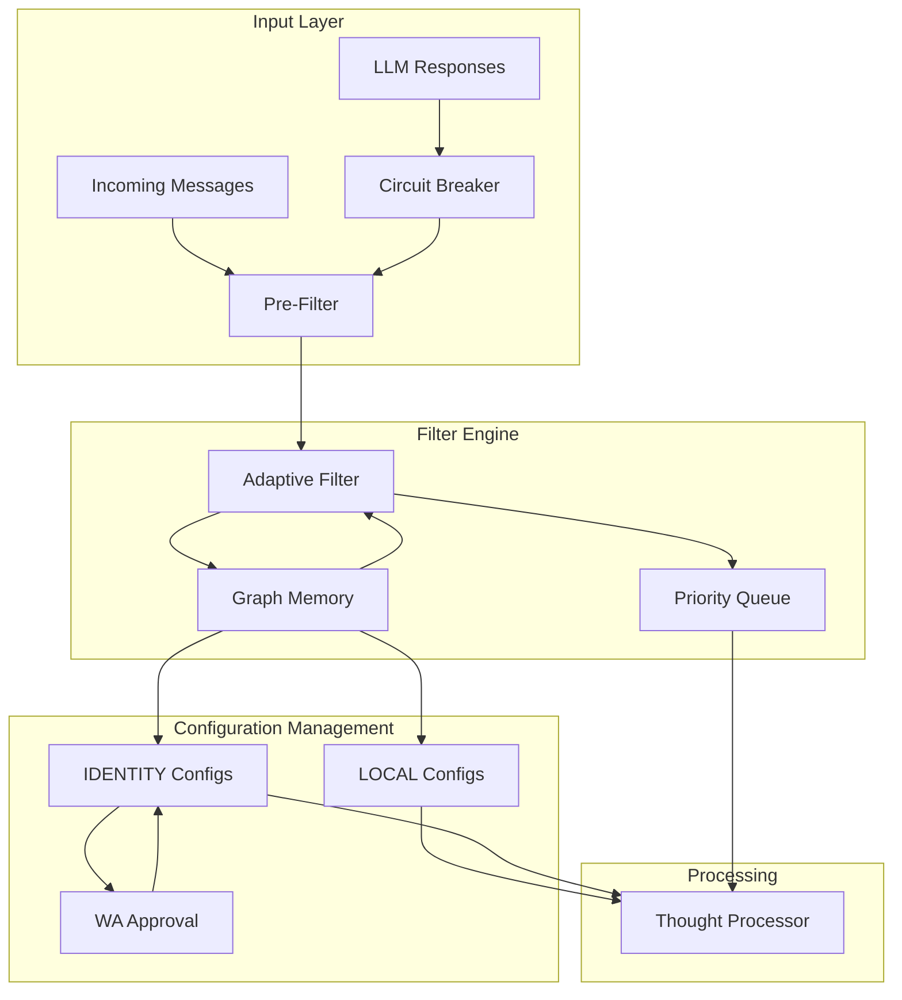

# CIRIS Agent Adaptive Configuration & Filtering System - Functional Specification Document

## Document Status
**Version**: 0.1.0-pre-beta  
**Status**: DRAFT  
**Last Updated**: 2025-01-06

## Executive Summary

This document specifies the Adaptive Configuration & Filtering System for CIRIS Agent, enabling agents to self-manage their operational configuration through graph memory while maintaining WA oversight for identity-critical changes. The system includes message filtering, configuration management, and LLM circuit breaker integration to protect against malicious or malfunctioning providers.

## Design Principles

1. **Self-Governance**: Agents manage their own operational configuration
2. **WA Protection**: Identity and ethical configurations require human approval
3. **Adaptive Learning**: Configurations improve through experience
4. **Universal Application**: Works across all adapters and services
5. **Fail-Safe**: Malicious LLM responses are filtered before processing

## Architecture Overview



## Data Structures

### Filter Schemas

```python
# ciris_engine/schemas/filter_schemas_v1.py
from pydantic import BaseModel, Field
from typing import List, Dict, Optional, Any, Literal, Pattern
from datetime import datetime
from enum import Enum
import re

class FilterPriority(str, Enum):
    """Message priority levels for agent attention"""
    CRITICAL = "critical"      # DMs, @mentions, name mentions
    HIGH = "high"             # New users, suspicious patterns
    MEDIUM = "medium"         # Random sampling, periodic health checks
    LOW = "low"               # Normal traffic
    IGNORE = "ignore"         # Filtered out completely

class TriggerType(str, Enum):
    """Types of filter triggers"""
    REGEX = "regex"           # Regular expression pattern
    COUNT = "count"           # Numeric threshold (e.g., emoji count)
    LENGTH = "length"         # Message length threshold
    FREQUENCY = "frequency"   # Message frequency (count:seconds)
    CUSTOM = "custom"         # Custom logic (e.g., is_dm)
    SEMANTIC = "semantic"     # Meaning-based (requires LLM)
    
class FilterTrigger(BaseModel):
    """Individual filter trigger definition"""
    trigger_id: str = Field(description="Unique identifier")
    name: str = Field(description="Human-readable name")
    pattern_type: TriggerType
    pattern: str = Field(description="Pattern or threshold value")
    priority: FilterPriority
    description: str
    enabled: bool = True
    
    # Learning metadata
    effectiveness: float = Field(default=0.5, ge=0.0, le=1.0)
    false_positive_rate: float = Field(default=0.0, ge=0.0, le=1.0)
    true_positive_count: int = 0
    false_positive_count: int = 0
    last_triggered: Optional[datetime] = None
    created_at: datetime = Field(default_factory=datetime.utcnow)
    created_by: str = Field(default="system")
    
    # For learned patterns
    learned_from: Optional[str] = None
    confidence: float = Field(default=1.0, ge=0.0, le=1.0)

class UserTrustProfile(BaseModel):
    """Track user behavior for adaptive filtering"""
    user_id: str
    message_count: int = 0
    violation_count: int = 0
    helpful_count: int = 0
    first_seen: datetime
    last_seen: datetime
    trust_score: float = Field(default=0.5, ge=0.0, le=1.0)
    flags: List[str] = Field(default_factory=list)
    roles: List[str] = Field(default_factory=list)
    
    # Behavioral patterns
    avg_message_length: float = 0.0
    avg_message_interval: float = 0.0  # seconds
    common_triggers: Dict[str, int] = Field(default_factory=dict)

class ConversationHealth(BaseModel):
    """Metrics for conversation health monitoring"""
    channel_id: str
    sample_rate: float = Field(default=0.1, ge=0.0, le=1.0)
    health_score: float = Field(default=0.5, ge=0.0, le=1.0)
    
    # Detailed metrics
    toxicity_level: float = Field(default=0.0, ge=0.0, le=1.0)
    engagement_level: float = Field(default=0.5, ge=0.0, le=1.0)
    topic_coherence: float = Field(default=0.5, ge=0.0, le=1.0)
    user_satisfaction: float = Field(default=0.5, ge=0.0, le=1.0)
    
    # Sampling data
    last_sample: Optional[datetime] = None
    samples_today: int = 0
    issues_detected: int = 0

class FilterResult(BaseModel):
    """Result of filtering a message"""
    message_id: str
    priority: FilterPriority
    triggered_filters: List[str]
    should_process: bool
    should_defer: bool = False
    reasoning: str
    confidence: float = Field(default=1.0, ge=0.0, le=1.0)
    
    # Context for handlers
    suggested_action: Optional[str] = None
    context_hints: Dict[str, Any] = Field(default_factory=dict)

class AdaptiveFilterConfig(BaseModel):
    """Complete filter configuration stored in graph memory"""
    config_id: str = Field(default_factory=lambda: f"filter_config_{datetime.utcnow().timestamp()}")
    version: int = 1
    
    # Core attention triggers (agent always sees these)
    attention_triggers: List[FilterTrigger] = Field(default_factory=list)
    
    # Suspicious pattern triggers
    review_triggers: List[FilterTrigger] = Field(default_factory=list)
    
    # LLM response filters (protect against malicious LLM)
    llm_filters: List[FilterTrigger] = Field(default_factory=list)
    
    # Channel-specific settings
    channel_configs: Dict[str, ConversationHealth] = Field(default_factory=dict)
    
    # User tracking
    new_user_threshold: int = Field(default=5, description="Messages before user is trusted")
    user_profiles: Dict[str, UserTrustProfile] = Field(default_factory=dict)
    
    # Adaptive learning settings
    auto_adjust: bool = True
    adjustment_interval: int = 3600  # seconds
    effectiveness_threshold: float = 0.3  # Disable filters below this
    false_positive_threshold: float = 0.2  # Review filters above this
    
    # Metadata
    last_adjustment: Optional[datetime] = None
    total_messages_processed: int = 0
    total_issues_caught: int = 0
```

### Configuration Node Extension

```python
# Add to ciris_engine/schemas/graph_schemas_v1.py

class ConfigNodeType(str, Enum):
    """Types of configuration nodes with scope requirements"""
    # LOCAL scope - agent can modify freely
    FILTER_CONFIG = "filter_config"              # Message filters
    CHANNEL_CONFIG = "channel_config"            # Channel-specific settings
    USER_TRACKING = "user_tracking"              # User behavior tracking
    RESPONSE_TEMPLATES = "response_templates"    # Canned responses
    TOOL_PREFERENCES = "tool_preferences"        # Which tools to use when
    
    # IDENTITY scope - requires WA approval
    BEHAVIOR_CONFIG = "behavior_config"          # Core personality
    ETHICAL_BOUNDARIES = "ethical_boundaries"    # Moral constraints
    CAPABILITY_LIMITS = "capability_limits"      # What agent can/cannot do
    TRUST_PARAMETERS = "trust_parameters"        # How agent evaluates trust
    LEARNING_RULES = "learning_rules"            # What agent can learn

# Configuration scope mapping
CONFIG_SCOPE_MAP = {
    ConfigNodeType.FILTER_CONFIG: GraphScope.LOCAL,
    ConfigNodeType.CHANNEL_CONFIG: GraphScope.LOCAL,
    ConfigNodeType.USER_TRACKING: GraphScope.LOCAL,
    ConfigNodeType.RESPONSE_TEMPLATES: GraphScope.LOCAL,
    ConfigNodeType.TOOL_PREFERENCES: GraphScope.LOCAL,
    ConfigNodeType.BEHAVIOR_CONFIG: GraphScope.IDENTITY,
    ConfigNodeType.ETHICAL_BOUNDARIES: GraphScope.IDENTITY,
    ConfigNodeType.CAPABILITY_LIMITS: GraphScope.IDENTITY,
    ConfigNodeType.TRUST_PARAMETERS: GraphScope.IDENTITY,
    ConfigNodeType.LEARNING_RULES: GraphScope.IDENTITY,
}
```

## Implementation Components

### 1. Adaptive Filter Service

```python
# ciris_engine/services/adaptive_filter_service.py
import re
import random
import asyncio
from typing import Dict, Any, Optional, List, Tuple
from datetime import datetime, timedelta

from ciris_engine.protocols.services import Service
from ciris_engine.schemas.filter_schemas_v1 import (
    FilterPriority, TriggerType, FilterTrigger, 
    UserTrustProfile, ConversationHealth, FilterResult,
    AdaptiveFilterConfig
)
from ciris_engine.schemas.graph_schemas_v1 import GraphNode, NodeType, GraphScope
from ciris_engine.schemas.memory_schemas_v1 import MemoryOpStatus

class AdaptiveFilterService(Service):
    """Service for adaptive message filtering with graph memory persistence"""
    
    def __init__(self, memory_service, llm_service=None):
        super().__init__()
        self.memory = memory_service
        self.llm = llm_service
        self._config: Optional[AdaptiveFilterConfig] = None
        self._config_node_id = "config/filter_config"
        self._message_buffer: Dict[str, List[Tuple[datetime, Any]]] = {}
        self._init_task = None
    
    async def start(self):
        """Start the service and load configuration"""
        await super().start()
        self._init_task = asyncio.create_task(self._initialize())
    
    async def _initialize(self):
        """Load or create initial configuration"""
        # Try to load existing config from graph memory
        node = GraphNode(
            id=self._config_node_id,
            type=NodeType.CONFIG,
            scope=GraphScope.LOCAL
        )
        
        result = await self.memory.recall(node)
        if result.status == MemoryOpStatus.OK and result.data:
            self._config = AdaptiveFilterConfig(**result.data["attributes"])
            logger.info(f"Loaded filter config version {self._config.version}")
        else:
            # Create default configuration
            self._config = self._create_default_config()
            await self._save_config("Initial configuration")
    
    def _create_default_config(self) -> AdaptiveFilterConfig:
        """Create default filter configuration"""
        config = AdaptiveFilterConfig()
        
        # Critical attention triggers
        config.attention_triggers = [
            FilterTrigger(
                trigger_id="dm_1",
                name="direct_message",
                pattern_type=TriggerType.CUSTOM,
                pattern="is_dm",
                priority=FilterPriority.CRITICAL,
                description="Direct messages to agent"
            ),
            FilterTrigger(
                trigger_id="mention_1",
                name="at_mention",
                pattern_type=TriggerType.REGEX,
                pattern=r"<@!?\d+>",  # Discord mention pattern
                priority=FilterPriority.CRITICAL,
                description="@ mentions"
            ),
            FilterTrigger(
                trigger_id="name_1",
                name="name_mention",
                pattern_type=TriggerType.REGEX,
                pattern=r"\b(echo|ciris|echo\s*bot)\b",
                priority=FilterPriority.CRITICAL,
                description="Agent name mentioned"
            ),
        ]
        
        # Review triggers
        config.review_triggers = [
            FilterTrigger(
                trigger_id="wall_1",
                name="text_wall",
                pattern_type=TriggerType.LENGTH,
                pattern="1000",
                priority=FilterPriority.HIGH,
                description="Long messages (walls of text)"
            ),
            FilterTrigger(
                trigger_id="flood_1",
                name="message_flooding",
                pattern_type=TriggerType.FREQUENCY,
                pattern="5:60",  # 5 messages in 60 seconds
                priority=FilterPriority.HIGH,
                description="Rapid message posting"
            ),
            FilterTrigger(
                trigger_id="emoji_1",
                name="emoji_spam",
                pattern_type=TriggerType.COUNT,
                pattern="10",
                priority=FilterPriority.HIGH,
                description="Excessive emoji usage"
            ),
            FilterTrigger(
                trigger_id="caps_1",
                name="caps_abuse",
                pattern_type=TriggerType.REGEX,
                pattern=r"[A-Z\s!?]{20,}",
                priority=FilterPriority.MEDIUM,
                description="Excessive caps lock"
            ),
        ]
        
        # LLM protection filters
        config.llm_filters = [
            FilterTrigger(
                trigger_id="llm_inject_1",
                name="prompt_injection",
                pattern_type=TriggerType.REGEX,
                pattern=r"(ignore previous|disregard above|new instructions|system:)",
                priority=FilterPriority.CRITICAL,
                description="Potential prompt injection in LLM response"
            ),
            FilterTrigger(
                trigger_id="llm_malform_1",
                name="malformed_json",
                pattern_type=TriggerType.CUSTOM,
                pattern="invalid_json",
                priority=FilterPriority.HIGH,
                description="Malformed JSON from LLM"
            ),
        ]
        
        return config
    
    async def filter_message(
        self, 
        message: Any,
        adapter_type: str,
        is_llm_response: bool = False
    ) -> FilterResult:
        """Apply filters to determine message priority and processing"""
        
        if not self._config:
            # Not initialized yet
            return FilterResult(
                message_id="unknown",
                priority=FilterPriority.MEDIUM,
                triggered_filters=[],
                should_process=True,
                reasoning="Filter not initialized"
            )
        
        triggered = []
        priority = FilterPriority.LOW
        confidence = 1.0
        
        # Extract message components
        content = self._extract_content(message, adapter_type)
        user_id = self._extract_user_id(message, adapter_type)
        channel_id = self._extract_channel_id(message, adapter_type)
        message_id = self._extract_message_id(message, adapter_type)
        is_dm = self._is_direct_message(message, adapter_type)
        
        # Apply appropriate filter sets
        if is_llm_response:
            filters = self._config.llm_filters
        else:
            filters = self._config.attention_triggers + self._config.review_triggers
        
        # Check filters
        for trigger in filters:
            if trigger.enabled and self._check_trigger(
                trigger, message, content, user_id, channel_id, is_dm
            ):
                triggered.append(trigger.name)
                if trigger.priority.value > priority.value:
                    priority = trigger.priority
                confidence *= trigger.confidence
        
        # Check user trust
        if user_id and not is_llm_response:
            trust_result = await self._check_user_trust(user_id)
            if trust_result["is_new"]:
                triggered.append("new_user")
                priority = max(priority, FilterPriority.HIGH)
            elif trust_result["trust_score"] < 0.3:
                triggered.append("low_trust_user")
                priority = max(priority, FilterPriority.HIGH)
        
        # Random sampling for health monitoring
        if channel_id and self._should_sample(channel_id):
            triggered.append("health_sample")
            priority = max(priority, FilterPriority.MEDIUM)
        
        # Determine actions
        should_process = priority != FilterPriority.IGNORE
        should_defer = priority == FilterPriority.CRITICAL and "potential_threat" in triggered
        
        # Update trigger effectiveness
        if triggered:
            asyncio.create_task(self._update_trigger_stats(triggered, message_id))
        
        return FilterResult(
            message_id=message_id,
            priority=priority,
            triggered_filters=triggered,
            should_process=should_process,
            should_defer=should_defer,
            reasoning=self._build_reasoning(triggered, priority),
            confidence=confidence,
            suggested_action=self._suggest_action(triggered, priority),
            context_hints={
                "user_trust": trust_result if user_id else None,
                "is_new_user": trust_result["is_new"] if user_id else False,
                "channel_health": self._get_channel_health(channel_id) if channel_id else None,
            }
        )
    
    def _check_trigger(
        self, 
        trigger: FilterTrigger,
        message: Any,
        content: str,
        user_id: Optional[str],
        channel_id: Optional[str],
        is_dm: bool
    ) -> bool:
        """Check if a trigger matches the message"""
        
        try:
            if trigger.pattern_type == TriggerType.REGEX:
                return bool(re.search(trigger.pattern, content, re.IGNORECASE))
            
            elif trigger.pattern_type == TriggerType.LENGTH:
                return len(content) > int(trigger.pattern)
            
            elif trigger.pattern_type == TriggerType.COUNT:
                # For emoji counting
                emoji_pattern = r'[\U0001F300-\U0001F9FF]'
                emoji_count = len(re.findall(emoji_pattern, content))
                return emoji_count > int(trigger.pattern)
            
            elif trigger.pattern_type == TriggerType.FREQUENCY:
                # Check message frequency
                if not user_id:
                    return False
                count, seconds = map(int, trigger.pattern.split(':'))
                return self._check_message_frequency(user_id, count, seconds)
            
            elif trigger.pattern_type == TriggerType.CUSTOM:
                if trigger.pattern == "is_dm":
                    return is_dm
                elif trigger.pattern == "invalid_json":
                    try:
                        import json
                        json.loads(content)
                        return False
                    except:
                        return True
            
            elif trigger.pattern_type == TriggerType.SEMANTIC:
                # Would require LLM analysis
                # For now, return False
                return False
                
        except Exception as e:
            logger.error(f"Error checking trigger {trigger.name}: {e}")
            
        return False
    
    def _check_message_frequency(
        self,
        user_id: str,
        threshold_count: int,
        threshold_seconds: int
    ) -> bool:
        """Check if user is posting too frequently"""
        
        now = datetime.utcnow()
        cutoff = now - timedelta(seconds=threshold_seconds)
        
        if user_id not in self._message_buffer:
            self._message_buffer[user_id] = []
        
        # Clean old messages
        self._message_buffer[user_id] = [
            (ts, msg) for ts, msg in self._message_buffer[user_id]
            if ts > cutoff
        ]
        
        return len(self._message_buffer[user_id]) >= threshold_count
    
    async def _check_user_trust(self, user_id: str) -> Dict[str, Any]:
        """Check user trust level"""
        
        profile = self._config.user_profiles.get(user_id)
        
        if not profile:
            # New user
            return {
                "is_new": True,
                "trust_score": 0.5,
                "message_count": 0
            }
        
        return {
            "is_new": profile.message_count < self._config.new_user_threshold,
            "trust_score": profile.trust_score,
            "message_count": profile.message_count,
            "violations": profile.violation_count
        }
    
    def _should_sample(self, channel_id: str) -> bool:
        """Determine if message should be randomly sampled"""
        
        config = self._config.channel_configs.get(
            channel_id,
            ConversationHealth(channel_id=channel_id)
        )
        
        return random.random() < config.sample_rate
    
    async def update_filter(
        self,
        operation: str,
        params: Dict[str, Any]
    ) -> bool:
        """Update filter configuration"""
        
        try:
            if operation == "add_trigger":
                trigger = FilterTrigger(**params["trigger"])
                target_list = params.get("list", "review_triggers")
                
                if target_list == "attention_triggers":
                    self._config.attention_triggers.append(trigger)
                elif target_list == "llm_filters":
                    self._config.llm_filters.append(trigger)
                else:
                    self._config.review_triggers.append(trigger)
                
            elif operation == "update_trigger":
                trigger_id = params["trigger_id"]
                updates = params["updates"]
                
                # Find and update trigger
                for trigger_list in [
                    self._config.attention_triggers,
                    self._config.review_triggers,
                    self._config.llm_filters
                ]:
                    for trigger in trigger_list:
                        if trigger.trigger_id == trigger_id:
                            for key, value in updates.items():
                                setattr(trigger, key, value)
                            break
            
            elif operation == "disable_trigger":
                trigger_id = params["trigger_id"]
                
                # Find and disable trigger
                for trigger_list in [
                    self._config.attention_triggers,
                    self._config.review_triggers,
                    self._config.llm_filters
                ]:
                    for trigger in trigger_list:
                        if trigger.trigger_id == trigger_id:
                            trigger.enabled = False
                            break
            
            elif operation == "update_channel_config":
                channel_id = params["channel_id"]
                if channel_id not in self._config.channel_configs:
                    self._config.channel_configs[channel_id] = ConversationHealth(
                        channel_id=channel_id
                    )
                
                for key, value in params.get("updates", {}).items():
                    setattr(self._config.channel_configs[channel_id], key, value)
            
            elif operation == "update_user_trust":
                user_id = params["user_id"]
                adjustment = params["adjustment"]
                
                if user_id in self._config.user_profiles:
                    profile = self._config.user_profiles[user_id]
                    profile.trust_score = max(0.0, min(1.0, 
                        profile.trust_score + adjustment
                    ))
            
            # Increment version and save
            self._config.version += 1
            await self._save_config(f"Updated via {operation}")
            
            return True
            
        except Exception as e:
            logger.error(f"Failed to update filter: {e}")
            return False
    
    async def _save_config(self, reason: str) -> bool:
        """Save configuration to graph memory"""
        
        node = GraphNode(
            id=self._config_node_id,
            type=NodeType.CONFIG,
            scope=GraphScope.LOCAL,
            attributes={
                **self._config.model_dump(),
                "config_type": ConfigNodeType.FILTER_CONFIG.value,
                "last_saved": datetime.utcnow().isoformat(),
                "save_reason": reason
            }
        )
        
        result = await self.memory.memorize(node)
        return result.status == MemoryOpStatus.OK
    
    async def learn_from_feedback(
        self,
        message_id: str,
        feedback_type: str,
        details: Dict[str, Any]
    ) -> None:
        """Learn from feedback about filtered messages"""
        
        if feedback_type == "false_positive":
            # A message was flagged but shouldn't have been
            trigger_names = details.get("triggered_filters", [])
            for name in trigger_names:
                await self._adjust_trigger_effectiveness(name, False)
                
        elif feedback_type == "false_negative":
            # A problematic message wasn't caught
            # Agent might create new trigger
            pattern = details.get("pattern")
            if pattern:
                new_trigger = FilterTrigger(
                    trigger_id=f"learned_{datetime.utcnow().timestamp()}",
                    name=f"learned_pattern_{len(self._config.review_triggers)}",
                    pattern_type=TriggerType.REGEX,
                    pattern=pattern,
                    priority=FilterPriority.HIGH,
                    description=f"Learned from missed issue: {details.get('reason', 'unknown')}",
                    learned_from=message_id,
                    confidence=0.6  # Start with lower confidence
                )
                self._config.review_triggers.append(new_trigger)
                await self._save_config(f"Learned new pattern from {feedback_type}")
    
    async def _adjust_trigger_effectiveness(
        self,
        trigger_name: str,
        was_correct: bool
    ) -> None:
        """Adjust trigger effectiveness based on feedback"""
        
        # Find trigger across all lists
        trigger = None
        for trigger_list in [
            self._config.attention_triggers,
            self._config.review_triggers,
            self._config.llm_filters
        ]:
            for t in trigger_list:
                if t.name == trigger_name:
                    trigger = t
                    break
            if trigger:
                break
        
        if not trigger:
            return
        
        # Update stats
        if was_correct:
            trigger.true_positive_count += 1
        else:
            trigger.false_positive_count += 1
        
        # Recalculate effectiveness
        total = trigger.true_positive_count + trigger.false_positive_count
        if total > 0:
            trigger.effectiveness = trigger.true_positive_count / total
            trigger.false_positive_rate = trigger.false_positive_count / total
        
        # Disable if too many false positives
        if (trigger.false_positive_rate > self._config.false_positive_threshold and 
            total > 10):  # Need enough samples
            trigger.enabled = False
            logger.warning(f"Disabled trigger {trigger.name} due to high false positive rate")
    
    def _build_reasoning(
        self,
        triggered: List[str],
        priority: FilterPriority
    ) -> str:
        """Build human-readable reasoning for filter decision"""
        
        if not triggered:
            return "No filters triggered, normal message"
        
        if priority == FilterPriority.CRITICAL:
            return f"Critical attention required: {', '.join(triggered)}"
        elif priority == FilterPriority.HIGH:
            return f"High priority review: {', '.join(triggered)}"
        elif priority == FilterPriority.MEDIUM:
            return f"Moderate attention: {', '.join(triggered)}"
        else:
            return f"Low priority: {', '.join(triggered)}"
    
    def _suggest_action(
        self,
        triggered: List[str],
        priority: FilterPriority
    ) -> Optional[str]:
        """Suggest action based on triggered filters"""
        
        if "message_flooding" in triggered:
            return "timeout_user"
        elif "spam" in triggered or "scam" in triggered:
            return "delete_message"
        elif "new_user" in triggered and priority == FilterPriority.HIGH:
            return "observe_closely"
        elif priority == FilterPriority.CRITICAL:
            return "immediate_response"
        
        return None
    
    # Extract methods for different adapter types
    def _extract_content(self, message: Any, adapter_type: str) -> str:
        """Extract message content based on adapter type"""
        if adapter_type == "discord":
            return getattr(message, "content", str(message))
        elif adapter_type == "slack":
            return getattr(message, "text", str(message))
        else:
            # Generic extraction
            for attr in ["content", "text", "message", "body"]:
                if hasattr(message, attr):
                    return str(getattr(message, attr))
            return str(message)
    
    def _extract_user_id(self, message: Any, adapter_type: str) -> Optional[str]:
        """Extract user ID based on adapter type"""
        if adapter_type == "discord":
            return getattr(message, "author_id", None)
        elif adapter_type == "slack":
            return getattr(message, "user", None)
        else:
            for attr in ["author_id", "user_id", "user", "sender"]:
                if hasattr(message, attr):
                    return str(getattr(message, attr))
            return None
    
    def _extract_channel_id(self, message: Any, adapter_type: str) -> Optional[str]:
        """Extract channel ID based on adapter type"""
        if adapter_type == "discord":
            return getattr(message, "channel_id", None)
        elif adapter_type == "slack":
            return getattr(message, "channel", None)
        else:
            for attr in ["channel_id", "channel", "room", "destination"]:
                if hasattr(message, attr):
                    return str(getattr(message, attr))
            return None
    
    def _extract_message_id(self, message: Any, adapter_type: str) -> str:
        """Extract message ID based on adapter type"""
        for attr in ["message_id", "id", "msg_id", "uuid"]:
            if hasattr(message, attr):
                return str(getattr(message, attr))
        
        # Generate a temporary ID if none found
        return f"unknown_{datetime.utcnow().timestamp()}"
    
    def _is_direct_message(self, message: Any, adapter_type: str) -> bool:
        """Check if message is a DM based on adapter type"""
        if adapter_type == "discord":
            return getattr(message, "is_dm", False)
        elif adapter_type == "slack":
            channel = getattr(message, "channel", "")
            return str(channel).startswith("D")  # Slack DMs start with D
        else:
            # Generic checks
            return (
                getattr(message, "is_dm", False) or
                getattr(message, "is_private", False) or
                getattr(message, "direct", False)
            )
```

### 2. LLM Circuit Breaker Integration

```python
# ciris_engine/adapters/llm_circuit_breaker.py
from typing import Any, Dict, Optional
import asyncio
from datetime import datetime, timedelta

from ciris_engine.adapters.openai_compatible_llm import OpenAICompatibleLLM
from ciris_engine.schemas.filter_schemas_v1 import FilterPriority

class LLMCircuitBreaker(OpenAICompatibleLLM):
    """
    Wrapper for LLM service that adds circuit breaker protection
    against malicious or malfunctioning responses
    """
    
    def __init__(self, filter_service, *args, **kwargs):
        super().__init__(*args, **kwargs)
        self.filter_service = filter_service
        self._failure_count = 0
        self._last_failure = None
        self._circuit_open = False
        self._circuit_open_until = None
        
        # Circuit breaker settings
        self.failure_threshold = 3
        self.reset_timeout = 300  # 5 minutes
        self.half_open_test_interval = 60  # 1 minute
    
    async def call_llm_structured(self, messages, response_model, **kwargs):
        """
        Override to add filtering and circuit breaker logic
        """
        
        # Check if circuit is open
        if self._circuit_open:
            if datetime.utcnow() < self._circuit_open_until:
                raise RuntimeError(
                    f"LLM circuit breaker is OPEN until {self._circuit_open_until}. "
                    f"Provider appears malicious or malfunctioning."
                )
            else:
                # Try half-open state
                self._circuit_open = False
                logger.info("LLM circuit breaker entering HALF-OPEN state for testing")
        
        try:
            # Make the actual LLM call
            response, usage = await super().call_llm_structured(
                messages, response_model, **kwargs
            )
            
            # Filter the response
            if response:
                filter_result = await self.filter_service.filter_message(
                    response,
                    adapter_type="llm",
                    is_llm_response=True
                )
                
                if filter_result.priority == FilterPriority.CRITICAL:
                    # Potential attack detected
                    self._record_failure("Critical filter triggered", filter_result)
                    raise RuntimeError(
                        f"LLM response blocked by security filter: {filter_result.reasoning}"
                    )
                
                elif filter_result.priority == FilterPriority.HIGH:
                    # Suspicious but not critical
                    logger.warning(
                        f"Suspicious LLM response: {filter_result.reasoning}"
                    )
                    
                    # Add warning to response metadata if possible
                    if hasattr(response, '_metadata'):
                        response._metadata['filter_warning'] = filter_result.reasoning
            
            # Success - reset failure count
            if self._failure_count > 0:
                logger.info("LLM circuit breaker: Successful response, resetting failure count")
                self._failure_count = 0
                self._last_failure = None
            
            return response, usage
            
        except Exception as e:
            # Record failure
            self._record_failure(str(e))
            
            # Check if we should open the circuit
            if self._failure_count >= self.failure_threshold:
                self._open_circuit()
            
            raise
    
    def _record_failure(self, reason: str, filter_result: Optional[Any] = None):
        """Record a failure and update circuit breaker state"""
        
        self._failure_count += 1
        self._last_failure = datetime.utcnow()
        
        logger.error(
            f"LLM failure #{self._failure_count}: {reason}"
        )
        
        # Log to audit if severe
        if filter_result and filter_result.priority == FilterPriority.CRITICAL:
            # This would trigger an audit log entry
            asyncio.create_task(
                self._audit_malicious_response(reason, filter_result)
            )
    
    def _open_circuit(self):
        """Open the circuit breaker"""
        
        self._circuit_open = True
        self._circuit_open_until = datetime.utcnow() + timedelta(
            seconds=self.reset_timeout
        )
        
        logger.critical(
            f"LLM CIRCUIT BREAKER OPENED! Too many failures ({self._failure_count}). "
            f"Circuit will remain open until {self._circuit_open_until}"
        )
        
        # Notify WA of potential issue
        asyncio.create_task(self._notify_wa_of_circuit_open())
    
    async def _audit_malicious_response(self, reason: str, filter_result: Any):
        """Create audit log entry for malicious response"""
        
        # This would integrate with the audit service
        logger.critical(
            f"SECURITY: Potential malicious LLM response detected. "
            f"Reason: {reason}, Filters: {filter_result.triggered_filters}"
        )
    
    async def _notify_wa_of_circuit_open(self):
        """Notify Wise Authority that circuit breaker has opened"""
        
        # This would integrate with the WA service
        logger.info("Notifying WA of LLM circuit breaker activation")
    
    async def test_circuit(self) -> bool:
        """Test if the circuit can be closed"""
        
        try:
            # Simple test query
            test_messages = [{
                "role": "user",
                "content": "Respond with 'OK' if you are functioning normally."
            }]
            
            response, _ = await self.call_llm_structured(
                test_messages,
                str,  # Simple string response
                max_tokens=10
            )
            
            return response and "OK" in str(response)
            
        except Exception:
            return False
```

### 3. Configuration Management Service

```python
# ciris_engine/services/agent_config_service.py
from typing import Dict, Any, Optional, List
from datetime import datetime

from ciris_engine.schemas.graph_schemas_v1 import (
    GraphNode, GraphScope, NodeType, ConfigNodeType, CONFIG_SCOPE_MAP
)
from ciris_engine.schemas.memory_schemas_v1 import MemoryOpResult, MemoryOpStatus
from ciris_engine.protocols.services import Service

class AgentConfigService(Service):
    """Service for agent self-configuration through graph memory"""
    
    def __init__(self, memory_service, wa_service=None):
        super().__init__()
        self.memory = memory_service
        self.wa_service = wa_service
        self._config_cache: Dict[str, Any] = {}
        self._pending_identity_updates: Dict[str, Any] = {}
    
    async def get_config(
        self, 
        config_type: ConfigNodeType,
        scope: Optional[GraphScope] = None
    ) -> Optional[Dict[str, Any]]:
        """Retrieve configuration from graph memory"""
        
        # Use default scope for config type if not specified
        if scope is None:
            scope = CONFIG_SCOPE_MAP.get(config_type, GraphScope.LOCAL)
        
        node_id = f"config/{config_type.value}"
        
        # Check cache first
        cache_key = f"{node_id}:{scope.value}"
        if cache_key in self._config_cache:
            cached = self._config_cache[cache_key]
            if cached["expires"] > datetime.utcnow():
                return cached["data"]
        
        # Fetch from memory
        node = GraphNode(
            id=node_id,
            type=NodeType.CONFIG,
            scope=scope
        )
        
        result = await self.memory.recall(node)
        if result.status == MemoryOpStatus.OK and result.data:
            config_data = result.data.get("attributes", {})
            
            # Cache for 5 minutes
            self._config_cache[cache_key] = {
                "data": config_data,
                "expires": datetime.utcnow() + timedelta(minutes=5)
            }
            
            return config_data
        
        return None
    
    async def update_config(
        self,
        config_type: ConfigNodeType,
        updates: Dict[str, Any],
        reason: str,
        thought_id: str,
        force_scope: Optional[GraphScope] = None
    ) -> MemoryOpResult:
        """Update configuration with automatic scope handling"""
        
        # Determine appropriate scope
        scope = force_scope or CONFIG_SCOPE_MAP.get(config_type, GraphScope.LOCAL)
        
        # Check if this requires WA approval
        if scope == GraphScope.IDENTITY:
            return await self._handle_identity_update(
                config_type, updates, reason, thought_id
            )
        
        # LOCAL scope - can update immediately
        return await self._direct_update(config_type, updates, reason, scope)
    
    async def _handle_identity_update(
        self,
        config_type: ConfigNodeType,
        updates: Dict[str, Any],
        reason: str,
        thought_id: str
    ) -> MemoryOpResult:
        """Handle IDENTITY scope updates that require WA approval"""
        
        # Store pending update
        pending_id = f"pending_identity_update_{thought_id}"
        self._pending_identity_updates[pending_id] = {
            "config_type": config_type,
            "updates": updates,
            "reason": reason,
            "thought_id": thought_id,
            "requested_at": datetime.utcnow().isoformat()
        }
        
        # Create deferral request
        deferral_node = GraphNode(
            id=f"config/pending/{pending_id}",
            type=NodeType.CONFIG,
            scope=GraphScope.LOCAL,  # Store pending request locally
            attributes={
                "status": "pending_wa_approval",
                "config_type": config_type.value,
                "proposed_updates": updates,
                "reason": reason,
                "impact_assessment": self._assess_impact(config_type, updates)
            }
        )
        
        # Store pending request
        await self.memory.memorize(deferral_node)
        
        # Notify WA if available
        if self.wa_service:
            await self.wa_service.send_deferral(
                thought_id,
                f"Identity configuration change requested: {config_type.value}"
            )
        
        # Return deferred status
        return MemoryOpResult(
            status=MemoryOpStatus.DEFERRED,
            reason=f"Identity configuration change requires WA approval: {reason}",
            data={"pending_id": pending_id}
        )
    
    async def _direct_update(
        self,
        config_type: ConfigNodeType,
        updates: Dict[str, Any],
        reason: str,
        scope: GraphScope
    ) -> MemoryOpResult:
        """Directly update configuration in specified scope"""
        
        node_id = f"config/{config_type.value}"
        
        # Get existing config
        existing = await self.get_config(config_type, scope)
        if existing:
            # Merge updates
            new_config = {**existing, **updates}
            new_config["version"] = existing.get("version", 0) + 1
            new_config["last_updated"] = datetime.utcnow().isoformat()
            new_config["update_reason"] = reason
        else:
            new_config = {
                **updates,
                "version": 1,
                "created_at": datetime.utcnow().isoformat(),
                "update_reason": reason
            }
        
        # Store in graph memory
        node = GraphNode(
            id=node_id,
            type=NodeType.CONFIG,
            scope=scope,
            attributes={
                "config_type": config_type.value,
                **new_config
            }
        )
        
        result = await self.memory.memorize(node)
        
        # Clear cache
        cache_key = f"{node_id}:{scope.value}"
        if cache_key in self._config_cache:
            del self._config_cache[cache_key]
        
        return result
    
    async def apply_wa_approved_update(
        self,
        pending_id: str,
        wa_decision: str,
        wa_feedback: Optional[str] = None
    ) -> MemoryOpResult:
        """Apply a WA-approved identity update"""
        
        if pending_id not in self._pending_identity_updates:
            return MemoryOpResult(
                status=MemoryOpStatus.DENIED,
                reason="Unknown pending update ID"
            )
        
        pending = self._pending_identity_updates[pending_id]
        
        if wa_decision != "approved":
            # WA denied the update
            await self._record_denial(pending_id, pending, wa_feedback)
            del self._pending_identity_updates[pending_id]
            
            return MemoryOpResult(
                status=MemoryOpStatus.DENIED,
                reason=f"WA denied update: {wa_feedback}"
            )
        
        # WA approved - apply to IDENTITY
        result = await self._direct_update(
            pending["config_type"],
            pending["updates"],
            f"WA approved: {pending['reason']}",
            GraphScope.IDENTITY
        )
        
        # Record approval
        await self._record_approval(pending_id, pending, wa_feedback, result)
        
        # Clean up
        del self._pending_identity_updates[pending_id]
        
        return result
    
    async def learn_from_experience(
        self,
        experience_type: str,
        context: Dict[str, Any],
        outcome: str,
        success: bool
    ) -> None:
        """Learn from experiences and update configurations"""
        
        # Store the experience
        experience_node = GraphNode(
            id=f"experience/{experience_type}/{datetime.utcnow().timestamp()}",
            type=NodeType.CONCEPT,
            scope=GraphScope.LOCAL,
            attributes={
                "type": experience_type,
                "context": context,
                "outcome": outcome,
                "success": success,
                "timestamp": datetime.utcnow().isoformat()
            }
        )
        
        await self.memory.memorize(experience_node)
        
        # Analyze and potentially update config
        if experience_type == "filter_effectiveness":
            await self._update_filter_config_from_experience(context, outcome, success)
        elif experience_type == "moderation_action":
            await self._update_moderation_config_from_experience(context, outcome, success)
        elif experience_type == "user_interaction":
            await self._update_behavior_config_from_experience(context, outcome, success)
    
    async def _update_filter_config_from_experience(
        self,
        context: Dict[str, Any],
        outcome: str,
        success: bool
    ) -> None:
        """Update filter configuration based on effectiveness"""
        
        # Get current filter config
        filter_config = await self.get_config(ConfigNodeType.FILTER_CONFIG)
        if not filter_config:
            return
        
        updates = {}
        
        if success and "missed_spam" in outcome:
            # Need to be more aggressive
            updates["review_threshold_adjustment"] = -0.1
            
        elif not success and "false_positive" in outcome:
            # Need to be less aggressive
            updates["review_threshold_adjustment"] = 0.1
        
        if updates:
            await self.update_config(
                ConfigNodeType.FILTER_CONFIG,
                updates,
                f"Learned from {outcome}",
                f"experience_{datetime.utcnow().timestamp()}"
            )
    
    def _assess_impact(
        self,
        config_type: ConfigNodeType,
        updates: Dict[str, Any]
    ) -> Dict[str, Any]:
        """Assess the impact of proposed changes for WA review"""
        
        impact = {
            "severity": "low",
            "affects_safety": False,
            "affects_ethics": False,
            "reversible": True,
            "scope": "self"
        }
        
        # Assess based on config type
        if config_type == ConfigNodeType.ETHICAL_BOUNDARIES:
            impact["severity"] = "critical"
            impact["affects_ethics"] = True
            impact["scope"] = "all_interactions"
            impact["reversible"] = False
        
        elif config_type == ConfigNodeType.BEHAVIOR_CONFIG:
            impact["severity"] = "medium"
            # Check specific updates
            if "humor_level" in updates and updates["humor_level"] > 0.8:
                impact["affects_safety"] = True
            if "assertiveness" in updates and updates["assertiveness"] > 0.9:
                impact["severity"] = "high"
        
        elif config_type == ConfigNodeType.CAPABILITY_LIMITS:
            impact["severity"] = "high"
            impact["affects_safety"] = True
            impact["reversible"] = False
        
        elif config_type == ConfigNodeType.TRUST_PARAMETERS:
            impact["severity"] = "medium"
            impact["affects_safety"] = True
            impact["scope"] = "community_safety"
        
        return impact
    
    async def _record_denial(
        self,
        pending_id: str,
        pending: Dict[str, Any],
        wa_feedback: Optional[str]
    ) -> None:
        """Record a denied configuration update"""
        
        denial_node = GraphNode(
            id=f"config/denied/{pending_id}",
            type=NodeType.CONFIG,
            scope=GraphScope.LOCAL,
            attributes={
                "config_type": pending["config_type"].value,
                "proposed_updates": pending["updates"],
                "denial_reason": wa_feedback or "WA did not approve",
                "denied_at": datetime.utcnow().isoformat(),
                "original_reason": pending["reason"]
            }
        )
        await self.memory.memorize(denial_node)
    
    async def _record_approval(
        self,
        pending_id: str,
        pending: Dict[str, Any],
        wa_feedback: Optional[str],
        result: MemoryOpResult
    ) -> None:
        """Record an approved configuration update"""
        
        approval_node = GraphNode(
            id=f"config/approved/{pending_id}",
            type=NodeType.CONFIG,
            scope=GraphScope.LOCAL,
            attributes={
                "config_type": pending["config_type"].value,
                "approved_updates": pending["updates"],
                "wa_feedback": wa_feedback,
                "approved_at": datetime.utcnow().isoformat(),
                "original_reason": pending["reason"],
                "applied_successfully": result.status == MemoryOpStatus.OK
            }
        )
        await self.memory.memorize(approval_node)
```

### 4. Integration with Service Registry

```python
# Add to ciris_engine/runtime/base_runtime.py

async def _init_adaptive_services(self):
    """Initialize adaptive configuration and filtering services"""
    
    # Get core services
    memory_service = await self.service_registry.get_service(
        "agent", "memory"
    )
    wa_service = await self.service_registry.get_service(
        "agent", "wise_authority"
    )
    llm_service = await self.service_registry.get_service(
        "agent", "llm"
    )
    
    # Initialize filter service
    filter_service = AdaptiveFilterService(
        memory_service=memory_service,
        llm_service=llm_service
    )
    await filter_service.start()
    
    # Register filter service
    self.service_registry.register(
        provider_id="adaptive_filter",
        service_type="filter",
        service=filter_service,
        priority=Priority.HIGH,
        capabilities=["message_filtering", "config_management"]
    )
    
    # Initialize config service
    config_service = AgentConfigService(
        memory_service=memory_service,
        wa_service=wa_service
    )
    await config_service.start()
    
    # Register config service
    self.service_registry.register(
        provider_id="agent_config",
        service_type="config",
        service=config_service,
        priority=Priority.HIGH,
        capabilities=["self_configuration", "wa_deferral"]
    )
    
    # Wrap LLM with circuit breaker
    if llm_service:
        protected_llm = LLMCircuitBreaker(
            filter_service=filter_service,
            **llm_service.__dict__  # Copy config
        )
        
        # Re-register as protected LLM with higher priority
        self.service_registry.register(
            provider_id="protected_llm",
            service_type="llm",
            service=protected_llm,
            priority=Priority.CRITICAL,  # Higher than original
            capabilities=llm_service.capabilities + ["circuit_breaker"]
        )
```

### 5. Observer Integration

```python
# Update DiscordObserver to use filtering

async def on_message(self, message):
    """Process incoming Discord message with filtering"""
    
    # Get filter service
    filter_service = await self.service_registry.get_service(
        "discord_observer", "filter"
    )
    
    if filter_service:
        # Apply filters
        filter_result = await filter_service.filter_message(
            message,
            adapter_type="discord"
        )
        
        # Check if should process
        if not filter_result.should_process:
            logger.debug(f"Message {message.id} filtered out: {filter_result.reasoning}")
            return
        
        # Add filter context to message
        enhanced_message = DiscordMessage(
            **message.__dict__,
            _filter_priority=filter_result.priority,
            _filter_context=filter_result.context_hints
        )
        
        # Priority-based handling
        if filter_result.priority == FilterPriority.CRITICAL:
            # Immediate processing
            await self._process_critical_message(enhanced_message)
        else:
            # Normal queue
            await self._queue_message(enhanced_message)
    else:
        # No filter service - process normally
        await self._queue_message(message)
```

## Configuration

```yaml
# config/adaptive_config.yaml
adaptive_config:
  enabled: true
  
  # Filter settings
  filtering:
    # Initial triggers are defined in code
    new_user_threshold: 5
    sample_rate_default: 0.1
    effectiveness_threshold: 0.3
    false_positive_threshold: 0.2
    
  # Learning settings
  learning:
    enabled: true
    adjustment_interval: 3600
    min_samples_for_adjustment: 10
    
  # Circuit breaker settings
  circuit_breaker:
    failure_threshold: 3
    reset_timeout: 300
    half_open_test_interval: 60
    
  # WA deferral settings
  identity_updates:
    require_wa_approval: true
    wa_timeout_hours: 72
    allow_emergency_override: false
```

## Testing Requirements

- [ ] Filter correctly identifies all default trigger patterns
- [ ] Circuit breaker opens after threshold failures
- [ ] LOCAL configs update immediately
- [ ] IDENTITY configs defer to WA
- [ ] Learning from feedback adjusts triggers
- [ ] Performance impact < 50ms per message
- [ ] Config persistence survives restarts
- [ ] Multi-adapter support verified

## Security Considerations

1. **LLM Protection**: Circuit breaker prevents cascading failures from malicious LLM
2. **Config Validation**: All config updates are validated before storage  
3. **WA Override**: Critical safety configs require human approval
4. **Audit Trail**: All config changes are logged with reasons
5. **Gradual Learning**: New patterns start with low confidence

## Conclusion

This adaptive configuration and filtering system provides Echo (and future agents) with:
- Self-management of operational configuration
- Protection against malicious inputs (including from LLM)
- Learning from experience while maintaining safety
- Universal application across all adapters
- WA oversight for identity-critical changes

The system is designed to be the final major feature needed for production deployment, providing both autonomy and safety guardrails.
