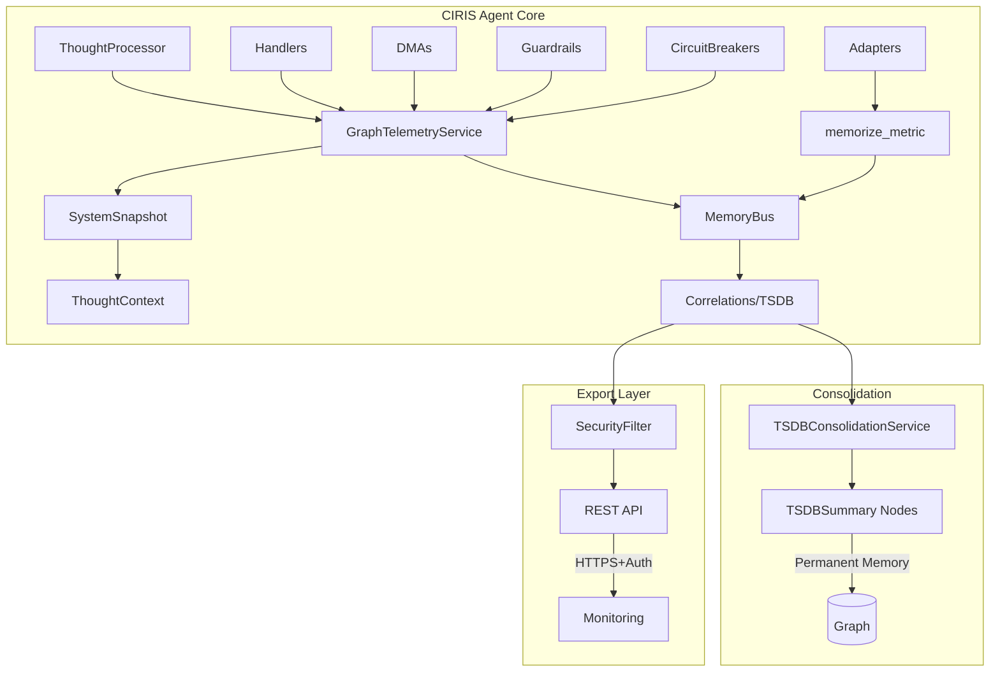

# CIRIS Agent Telemetry System - Functional Specification Document

## Document Status
**Version**: 0.1.0-pre-alpha  
**Status**: DRAFT  
**Last Updated**: 2025-04-09

## Executive Summary

This document specifies the telemetry system for the CIRIS Agent, designed to provide comprehensive observability while maintaining the agent's ability to introspect its own operational state. The system prioritizes **security and safety over performance**, implementing defense-in-depth principles and assuming a hostile operational environment.

**Update (June 2025)**: The telemetry system has been simplified to use a single, unified flow through the memory bus's `memorize_metric()` method, eliminating orphaned node types and ensuring all telemetry data flows through the correlation-based TSDB system.

### Critical Design Principles

1. **Safety First**: All telemetry data is considered potentially sensitive. No PII or conversation content in metrics.
2. **Agent Self-Awareness**: The agent must have full visibility into its own metrics via the system snapshot.
3. **Secure by Default**: All external endpoints require authentication and use TLS.
4. **Minimal Attack Surface**: Telemetry system must not introduce new vulnerabilities.
5. **Fail Secure**: If telemetry fails, the agent continues operating safely.

## Architecture Overview



## Security Requirements

### Data Classification

| Data Type | Classification | Handling Requirements |
|-----------|---------------|----------------------|
| Thought Content | RESTRICTED | Never included in telemetry |
| User Identifiers | SENSITIVE | Hashed before storage |
| System Metrics | INTERNAL | Filtered for safe values |
| Resource Usage | PUBLIC | Aggregated only |
| Error Messages | SENSITIVE | Sanitized before export |

### Access Control

1. **Internal Access** (Agent → Own Metrics): Unrestricted read via SystemSnapshot
2. **Export Access** (Telemetry → External): Requires authentication + TLS
3. **API Access** (Clients → Telemetry): OAuth2 + rate limiting
4. **Storage Access** (Telemetry → Disk): Encrypted at rest

## Functional Requirements

### FR-001: Agent Self-Introspection

The agent MUST have access to its own metrics through the SystemSnapshot without external dependencies.

```python
class SystemSnapshot(BaseModel):
    # Existing fields...
    
    # New telemetry fields
    telemetry: TelemetrySnapshot = Field(default_factory=TelemetrySnapshot)
    
class TelemetrySnapshot(BaseModel):
    """Real-time telemetry data available to the agent"""
    # Performance metrics
    thoughts_active: int = 0
    thoughts_processed_total: int = 0
    thoughts_failed_total: int = 0
    average_thought_latency_ms: float = 0.0
    
    # Resource consumption
    tokens_consumed_total: int = 0
    estimated_cost_usd: float = 0.0
    estimated_co2_grams: float = 0.0
    
    # Safety metrics
    guardrail_hits_total: int = 0
    guardrail_hits_by_type: Dict[str, int] = Field(default_factory=dict)
    circuit_breakers_open: List[str] = Field(default_factory=list)
    
    # Handler metrics
    handler_invocations: Dict[str, int] = Field(default_factory=dict)
    handler_errors: Dict[str, int] = Field(default_factory=dict)
    
    # System health
    error_count_total: int = 0
    uptime_seconds: float = 0.0
    last_update_timestamp: str = ""
```

### FR-002: Tiered Metric Collection

Metrics MUST be collected in tiers with security validation:

| Tier | Interval | Security Check | Use Case |
|------|----------|----------------|----------|
| INSTANT | 50ms | Rate limit check | Circuit breakers, critical errors |
| FAST | 250ms | Value bounds check | Active thoughts, handler selection |
| NORMAL | 1s | Aggregation only | Resource usage, guardrails |
| SLOW | 5s | Sanitization | Memory operations, DMAs |
| AGGREGATE | 30s | Full audit | Community metrics, rollups |

### FR-003: Security Filtering

All metrics MUST pass through security filters before export:

```python
class SecurityFilter:
    """Filters metrics to prevent information leakage"""
    
    def filter_metric(self, metric: MetricData) -> Optional[MetricData]:
        # Remove any PII
        if self._contains_pii(metric):
            return None
            
        # Sanitize error messages
        if metric.name.endswith('.error'):
            metric.value = self._sanitize_error(metric.value)
            
        # Validate bounds
        if not self._validate_bounds(metric):
            logger.warning(f"Metric {metric.name} out of bounds")
            return None
            
        # Rate limit check
        if not self._check_rate_limit(metric):
            return None
            
        return metric
```

### FR-004: Time Travel with Security

The system MUST support historical snapshots with security controls:

1. Maximum history retention: 1 hour (configurable)
2. Snapshots are sanitized before storage
3. Access to historical data requires additional authorization
4. Automatic purging of old data

### FR-005: Export Security

All data export MUST be secure:

1. **OTLP Export**: mTLS required, certificate pinning
2. **WebSocket**: WSS only, JWT authentication, rate limiting
3. **REST API**: HTTPS only, OAuth2, request signing
4. **No plaintext exports** under any circumstances

## Implementation Tasks

### Phase 1: Core Telemetry Service (Security Hardened) ✅ COMPLETED

**Task 1.1: GraphTelemetryService Implementation** ✅
- Implemented as one of the 19 core services
- Uses memorize_metric() for unified telemetry flow
- Integrates with SystemSnapshot for agent introspection
- Security filtering built into the correlation layer

**Task 1.2: Implement Security Filter**
```python
# ciris_engine/telemetry/security.py
# TODO: Create SecurityFilter class with:
# - PII detection and removal
# - Error message sanitization
# - Metric bounds validation
# - Rate limiting per metric type
# Priority: CRITICAL
# Security: This is a security control, requires thorough testing
```

**Task 1.3: Create Metric Definitions**
```python
# ciris_engine/telemetry/metrics.py
# TODO: Define all metrics with:
# - Security classifications
# - Acceptable value ranges
# - Sanitization requirements
# - Export permissions
# Priority: HIGH
```

### Phase 2: Agent Integration

**Task 2.1: Update SystemSnapshot**
```python
# ciris_engine/schemas/context_schemas_v1.py
# TODO: Add TelemetrySnapshot to SystemSnapshot
# - Ensure all metrics are read-only
# - Implement update mechanism from TelemetryService
# - Add validation for snapshot data
# Priority: CRITICAL
```

**Task 2.2: Integrate with ThoughtProcessor**
```python
# ciris_engine/processor/thought_processor.py
# TODO: Add telemetry instrumentation:
# - Wrap process_thought with spans
# - Record thought lifecycle metrics
# - Update SystemSnapshot telemetry
# Priority: HIGH
# Security: No thought content in metrics
```

**Task 2.3: Integrate with Handlers**
```python
# ciris_engine/action_handlers/base_handler.py
# TODO: Add telemetry to all handlers:
# - Record handler invocations
# - Track handler errors (sanitized)
# - Measure handler latency
# Priority: HIGH
```

**Task 2.4: Integrate with Resource Tracking**
```python
# ciris_engine/adapters/openai_compatible_llm.py
# TODO: Add resource metrics:
# - Token counting (no content)
# - Cost estimation (aggregated)
# - CO2 estimation (aggregated)
# Priority: MEDIUM
```

### Phase 3: Collectors and Storage

**Task 3.1: Implement Tiered Collectors**
```python
# ciris_engine/telemetry/collectors.py
# TODO: Create collector classes:
# - InstantCollector (circuit breakers, errors)
# - FastCollector (active thoughts, handlers)
# - NormalCollector (resources, guardrails)
# - SlowCollector (memory ops, DMAs)
# - AggregateCollector (community, rollups)
# Priority: MEDIUM
# Security: Each collector must validate data before collection
```

**Task 3.2: Implement Secure Storage**
```python
# ciris_engine/telemetry/storage.py
# TODO: Create time series storage:
# - Encrypted at rest (use cryptography.Fernet)
# - Automatic expiration (1 hour default)
# - Secure deletion of expired data
# - Size limits to prevent DoS
# Priority: MEDIUM
# Security: Use AES-256-GCM for encryption
```

### Phase 4: Export Layer (Secure)

**Task 4.1: OTLP Exporter with mTLS**
```python
# ciris_engine/telemetry/exporters/otlp.py
# TODO: Implement secure OTLP export:
# - mTLS configuration
# - Certificate validation
# - Retry with backoff
# - Dead letter queue for failed exports
# Priority: LOW
# Security: Certificate pinning required
```

**Task 4.2: WebSocket Server (Authenticated)**
```python
# ciris_engine/runtime/api/api_telemetry.py
# TODO: Create WebSocket endpoint:
# - JWT authentication
# - Rate limiting per client
# - Filtered metric streaming
# - Graceful disconnection
# Priority: LOW
# Security: WSS only, validate all client input
```

**Task 4.3: REST API (Secured)**
```python
# ciris_engine/runtime/api/api_telemetry_rest.py
# TODO: Create REST endpoints:
# - GET /v1/telemetry/snapshot (OAuth2)
# - GET /v1/telemetry/history (OAuth2 + additional scope)
# - POST /v1/telemetry/control (admin only)
# Priority: LOW
# Security: Request signing, rate limiting
```

### Phase 5: Testing and Validation

**Task 5.1: Security Test Suite**
```python
# tests/telemetry/test_security.py
# TODO: Create security tests:
# - PII leakage tests
# - Bounds validation tests
# - Rate limiting tests
# - Authentication/authorization tests
# Priority: CRITICAL
```

**Task 5.2: Performance Tests**
```python
# tests/telemetry/test_performance.py
# TODO: Verify telemetry overhead:
# - Memory usage < 100MB
# - CPU overhead < 5%
# - No impact on thought processing latency
# Priority: HIGH
```

**Task 5.3: Integration Tests**
```python
# tests/telemetry/test_integration.py
# TODO: End-to-end tests:
# - Agent can read its own metrics
# - Metrics flow through all tiers
# - Time travel works correctly
# - Export security is enforced
# Priority: HIGH
```

## Configuration

```yaml
# config/telemetry.yaml
telemetry:
  enabled: true
  security:
    require_tls: true
    require_auth: true
    pii_detection: true
    max_history_hours: 1
    encryption_key: "${TELEMETRY_ENCRYPTION_KEY}"
  
  collectors:
    instant:
      interval_ms: 50
      max_buffer_size: 1000
    fast:
      interval_ms: 250
      max_buffer_size: 5000
    normal:
      interval_ms: 1000
      max_buffer_size: 10000
    slow:
      interval_ms: 5000
      max_buffer_size: 5000
    aggregate:
      interval_ms: 30000
      max_buffer_size: 1000
  
  export:
    otlp:
      enabled: false  # Disabled by default in pre-alpha
      endpoint: "localhost:4317"
      use_mtls: true
      cert_path: "/etc/ciris/certs/telemetry.crt"
      key_path: "/etc/ciris/certs/telemetry.key"
      ca_path: "/etc/ciris/certs/ca.crt"
    
    websocket:
      enabled: false  # Disabled by default in pre-alpha
      port: 8443
      use_tls: true
      cert_path: "/etc/ciris/certs/ws.crt"
      key_path: "/etc/ciris/certs/ws.key"
      jwt_secret: "${TELEMETRY_JWT_SECRET}"
      max_connections: 10
      rate_limit_per_second: 100
    
    api:
      enabled: false  # Disabled by default in pre-alpha
      auth_required: true
      oauth2_issuer: "https://auth.ciris.local"
      allowed_scopes: ["telemetry:read", "telemetry:history"]
```

## Security Considerations

### Threat Model

1. **Data Exfiltration**: Attacker tries to extract conversation content via metrics
   - **Mitigation**: No content in metrics, PII filtering, sanitization
   
2. **Resource Exhaustion**: Attacker floods telemetry to cause DoS
   - **Mitigation**: Buffer size limits, rate limiting, fail-secure design
   
3. **Information Disclosure**: Metrics reveal system internals
   - **Mitigation**: Metric sanitization, aggregation, access control
   
4. **Man-in-the-Middle**: Attacker intercepts telemetry data
   - **Mitigation**: TLS/mTLS required, certificate pinning

### Security Checklist

- [ ] All metrics are classified and handled per classification
- [ ] No PII or conversation content in any metric
- [ ] All external communication uses TLS
- [ ] Authentication required for all endpoints
- [ ] Rate limiting implemented on all APIs
- [ ] Metric values are bounds-checked
- [ ] Error messages are sanitized
- [ ] Storage is encrypted at rest
- [ ] Automatic data expiration is configured
- [ ] Security tests cover all threat scenarios

## Testing Requirements

### Unit Tests
- Each collector must have 100% code coverage
- Security filter must be thoroughly tested
- All edge cases must be handled

### Integration Tests
- End-to-end metric flow
- Agent self-introspection
- Export security validation

### Security Tests
- Penetration testing of all endpoints
- Fuzzing of metric inputs
- PII detection validation

### Performance Tests
- Overhead must be < 5% CPU
- Memory usage must be < 100MB
- No impact on thought processing

## Rollout Plan

### Pre-Alpha (Current Phase)
1. Implement core telemetry with security filters
2. Agent self-introspection only (no exports)
3. Extensive security testing
4. Performance validation

## Acceptance Criteria

1. **Security**: Passes all security tests, no PII leakage
2. **Performance**: < 5% overhead, < 100MB memory
3. **Functionality**: Agent can introspect all metrics
4. **Reliability**: Telemetry failures don't affect agent operation
5. **Compliance**: Meets all data protection requirements

---

*Copyright © 2025 Eric Moore and CIRIS L3C - Apache 2.0 License*

